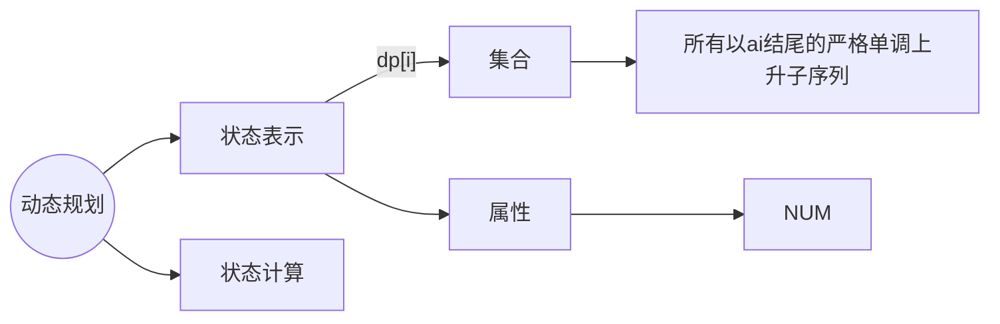
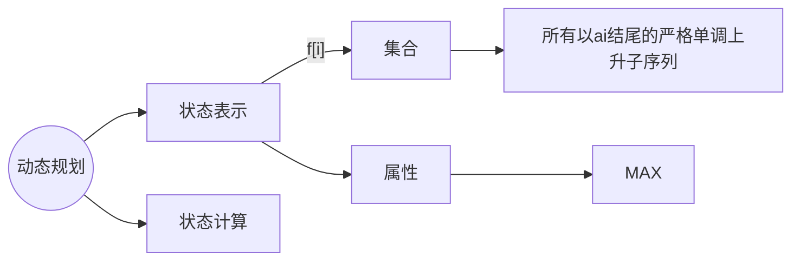
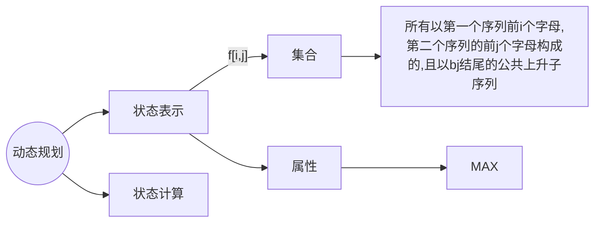

# LIS

# **最长上升子序列**



**划分依据："最后一个不同的点"**


当倒数第二位为空，则长度为 $1$

如果倒数第二位为 $a[k]$，

​	讨论第 $k$ 类中的上升子序列:

​	就是以 $a[k]$ 为结尾的上升子序列长度最大值再加 $1$

​	也就是 $f[k] + 1$

所以最终 $f[i] = MAX(f[1] + 1, f[2] + 1, ...,f[k] +1, 1)$

但是这些类只有在 $a[k] < a[i]$ 时存在

## **暴力做法 $O(n ^ 2)$**

$dp[i]$ 是以 $a_i$ 为末尾的最长上升子序列的长度

以 $a_i$ 结尾的上升子序列

1. 只包含 $a_i$ 的子序列
2. 在满足 $j < i$ 并且 $a_j < a_i$ 的以 $a_j$ 为结尾的上升子序列末尾，追加上 $a_i$ 后得到的子序列

```c++
void solve()
{
    cin >> n;
    for(int i = 0; i < n; i ++)
        cin >> a[i];
    
    int ans = 0;
    fill(dp, dp + n, 1);
    for(int i = 0; i < n; i ++)
    {
        for(int j = 0; j < i; j ++)
        {
            if(a[j] < a[i])
                dp[i] = max(dp[i], dp[j] + 1);
        }
        
        ans = max(ans, dp[i]);
    }
        
    cout << ans << endl;
}
```


## 优化 $O(logn)$

$L[n]$ 表示长度为 $i + 1$ 的递增子序列的末尾元素的最小值

$len_i$ 表示前 $i$ 个元素构成的最长递增子序列的长度

由于 $len_i$ 是按照升序记录的，所以可以用二分搜索来求 $L[j]~(j = 0 \sim len - 1)$ 中第一个大于等于 $A[i]$ 的元素的下标 $j$

```c++
void solve()
{
    int len = 1;

    cin >> n;
    for(int i = 0; i < n; i ++)
        cin >> a[i];

    L[0] = a[0];

    for(int i = 1; i < n; i ++)
    {
        //如果末尾元素比当前的元素小则序列加长
        if(L[len - 1] < a[i])
        {
            L[len ++] = a[i];
        }
        //更新 L[] 中所表示的递增子序列中的末尾元素的最小值
        else
            *lower_bound(L, L + len, a[i]) = a[i];
        //如果末尾元素大，则序列中按大小插入替换当前元素，序列长度不变
        //找到 L[j] 中第一个大于等于 a[i] 的元素的下标 j 
    }

    cout << len << endl;
}
```

## 怪盗基德的滑翔翼
[原题链接](https://www.acwing.com/problem/content/1019/)

确定完起点和方向后，求最长的距离是多少。
假设起点为 h[i]
如果往左跳，那么能跳的最长距离也就是以 h\[i] 为结尾的最长上升子序列长度（从左往右看）
如果往右跳，那么能跳的最长距离也就是以 h\[i] 为结尾的最长上升子序列长度（从右往左看）
所以要做两次最长上升子序列问题
```cpp
#include<bits/stdc++.h>

using namespace std;

const int N = 150;

int t;
int f[N], h[N];

int main()
{
    cin >> t;
    while(t --)
    {
        int n;
        cin >> n;
        for(int i = 1; i <= n; i ++)
            cin >> h[i];
        
        int res = 0;
        for(int i = 1; i <= n; i ++)
        {
            f[i] = 1;
            for(int j = 1; j < i; j ++)
            {
                if(h[j] < h[i])
                    f[i] = max(f[i], f[j] + 1);
            }
            res = max(res, f[i]);
        }

        for(int i = n; i; i --)
        {
            f[i] = 1;
            for(int j = n; j > i; j --)
            {
                if(h[i] > h[j])
                {
                    f[i] = max(f[i], f[j] + 1);
                }
            }
            res = max(res, f[i]);
        }
        cout << res << endl;
    }

    return 0;
}
```

## 登山
[原题链接](https://www.acwing.com/file_system/file/content/whole/index/content/5615/)
条件1：按照编号递增的顺序来浏览 -> 必然是子序列
条件2：相邻两个景点不能相同
条件3：一旦开始下降就不能再上升了
可见，是一个先单调递增，再单调递减的序列。


目标：所有形状是上面这种子序列长度的最大值
以峰值是哪个分类：

如果以 $a_k$ 作为峰值。
目标：求出第 k 类的最大长度

左右两侧最大值互不干扰，所以可以分别求出两边最大值，然后相加
$a_k$ 左边是从左往右以它为结尾的上升子序列最大长度 $f_1(k)$
$a_k$ 右边是从右往左以它为结尾的上升子序列最大长度 $f_2(k)$
$ans=f_1(k)+f_2(k)-1$
```cpp
#include<bits/stdc++.h>

using namespace std;

const int N = 1050;

int f1[N], f2[N], h[N];
int n;

int main()
{
    cin >> n;

    for(int i = 1; i <= n; i ++)
        cin >> h[i];

    int ans = 0;

    for(int i = n; i; i --)
    {
        f1[i] = 1;
        for(int j = n; j > i; j --)
        {
            if(h[i] > h[j])
            {
                f1[i] = max(f1[i], f1[j] + 1);
            }
        }
    }

    for(int i = 1; i <= n; i ++)
    {
        f2[i] = 1;
        for(int j = 1; j < i; j ++)
        {
            if(h[i] > h[j])
            {
                f2[i] = max(f2[i], f2[j] + 1);
            }
        }
    }

    for(int i = 1; i <= n; i ++)
    {
        int res = f1[i] + f2[i];
        ans = max(ans, res);
    }


    cout << ans - 1 << endl;

    return 0;
}

```

## 友好城市
[原题链接](https://www.acwing.com/problem/content/1014/)


条件1：每个城市上只能建立一座桥
条件2：所有桥与桥之间不能相交
目标：最多可以建立多少桥？

对于任意的合法建桥方式，都对应一种因变量的单调上升子序列。
反之，对于因变量的上升子序列，都对应合法的建桥方式。

所以，合法建桥方式长度最大值就对应上升子序列长度的最大值。

可以按照因变量排序，然后求自变量的最长上升子序列长度最大值。
```cpp
#include<bits/stdc++.h>
#define x first 
#define y second

using namespace std;

typedef pair<int, int> PII;
const int N = 5050;

PII q[N];
int f[N];
int n;

int main()
{
    cin >> n;

    for(int i = 1; i <= n; i ++)
        cin >> q[i].x >> q[i].y;
    sort(q + 1, q + n + 1);

    int res = 0;

    for(int i = 1; i <= n; i ++)
    {
        f[i] = 1;
        for(int j = 1; j < i; j ++)
        {
            if(q[i].y > q[j].y)
                f[i] = max(f[i], f[j] + 1);
        }
        res = max(res, f[i]);
    }

    cout << res << endl;

    return 0;
}
```

## 最大上升子序列和
[原题链接](https://www.acwing.com/problem/content/1018/)

以倒数第二个数是谁分类。

$f[i]=max(f[i], f[j]+a[i])$
```cpp
#include<bits/stdc++.h>

using namespace std;

const int N = 1050;

int n;
int f[N], a[N];

int main()
{
    cin >> n;

    for(int i = 1; i <= n; i ++)
        cin >> a[i];

    int res = 0;

    for(int i = 1; i <= n; i ++)
    {
        f[i] = a[i];
        for(int j = 1; j < i; j ++)
        {
            if(a[i] > a[j])
                f[i] = max(f[i], f[j] + a[i]);
        }
        res = max(res, f[i]);
    }

    cout << res << endl;

    return 0;
}
```

## [NOIP1999 提高组] 导弹拦截
[原题链接](https://www.luogu.com.cn/problem/P1020)
贪心；
	从前往后扫描每个数，对于每个数：
		情况1：如果现有的子序列的结尾都小于当前数，则创建一个新的子序列
		情况2：将当前数放到结尾大于等于它的最小的子序列后面
	g[] 数组存储每个序列最小值
```cpp
#include<bits/stdc++.h>

using namespace std;

const int N = 1010;

int q[N], f[N], g[N];
int n, cnt;

int main()
{
    ios::sync_with_stdio(0), cin.tie(0), cout.tie(0);
    while(cin >> q[n]) 
        n ++;
    
    int res = 0;
    for(int i = 0; i < n; i ++)
    {
        f[i] = 1;
        for(int j = 0; j < i; j ++)
        {
            if(q[j] >= q[i])
                f[i] = max(f[i], f[j] + 1);
        }
        res = max(res, f[i]);
    }

    cout << res << endl;

    for(int i = 0; i < n; i ++)
    {
        int k = 0;
        while(k < cnt && g[k] < q[i])
            k ++;
        g[k] = q[i];
        if(k >= cnt)
            cnt ++;
    }

    cout << cnt << endl;

    return 0;
}
```

## 导弹防御系统
[原题链接](https://www.acwing.com/activity/content/problem/content/1265/)

```cpp
#include<bits/stdc++.h>

using namespace std;

const int N = 55;

int h[N], up[N], down[N];
int n;
int ans = n;

void dfs(int u, int su, int sd)
{
    if(su + sd >= ans)
        return ;
    if(u == n)
    {
        ans = min(ans, su + sd);
        return ;
    }

    int k = 0;

    while(k < su && up[k] >= h[u])
        k ++;
    if(k < su)
    {
        int t = up[k];
        up[k] = h[u];
        dfs(u + 1, su, sd);
        up[k] = t;
    } 
    else
    {
        up[k] = h[u];
        dfs(u + 1, su + 1, sd);
    }
        
    k = 0;
    while(k < sd && down[k] <= h[u])
        k ++;
    if(k < sd)
    {
        int t = down[k];
        down[k] = h[u];
        dfs(u + 1, su, sd);
        down[k] = t;
    } 
    else
    {
        down[k] = h[u];
        dfs(u + 1, su, sd + 1);
    }
}

int main()
{
    while(cin >> n, n)
    {
        for(int i = 0; i < n; i ++)
            cin >> h[i];
        
        ans = n;

        dfs(0, 0, 0);

        cout << ans << endl;
    }

    return 0;
}
```


### 最长公共上升子序列



#### $O(n^3)$ 做法
```cpp
#include<bits/stdc++.h>

using namespace std;

const int N = 3010;

int n;
int a[N], b[N];
int f[N][N];

int main()
{
    cin >> n;

    for(int i = 1; i <= n; i ++)
        cin >> a[i];
    
    for(int i = 1; i <= n; i ++)
        cin >> b[i];
    
    for(int i = 1; i <= n; i ++)
        for(int j = 1; j <= n; j ++)
        {
            f[i][j] = f[i - 1][j];
            if(a[i] == b[j])
            {
                f[i][j] = max(f[i][j], 1);
                for(int k = 1; k < j; k ++)
                {
                    if(b[k] < b[j])
                        f[i][j] = max(f[i][j], f[i - 1][k] + 1);
                }
            }
        }

    int res = 0;

    for(int i = 1; i <= n; i ++)
        res = max(res, f[n][i]);
    
    cout << res << endl;

    return 0;
}
```
$f(i,j)=max(f_{i,j}, f_{i - 1, k} + 1)$
每次用到的状态都是第 $i - 1$ 个阶段。所以可以用一个变量存储上一个阶段的能够在 $a[i]$ 前面的最大的状态值。
```cpp
for(int i = 1; i <= n; i ++)
    {
        int maxv = 1;
        for(int j = 1; j <= n; j ++)
        {
            f[i][j] = f[i - 1][j]; 
            if(a[i] == b[j]) 
                f[i][j] = max(f[i][j], maxv);
            if(b[j] < a[i])
                maxv = max(maxv, f[i - 1][j] + 1);
        }
    }
```