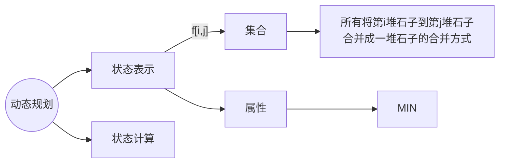
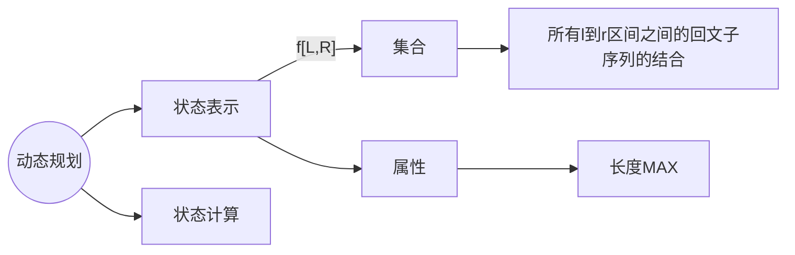

### 石子合并



以最后一次分界线的位置分类


假设红色分界线位置为 $m$

则左侧是 $[i,m]$ 右侧是 $[m+1,j]$

则最小代价是 $f[i,j] = Min(f[i,m] + f[m+1,j] + s[j] -s[i-1])$

$s[j] -s[i-1]$ 为区间 $[i,j]$ 中石子重量的总和(前缀和)

$m ∈ (i, j)$

$DP$ 两维 $n^2$，又因为要枚举 $k$ 所以时间复杂度 $O(n^2\times n) =O(n^3)$

```cpp
#include<bits/stdc++.h>

using namespace std;

const int N = 350;

int f[N][N];
int n;
int a[N];

int main()
{
    cin >> n;

    for(int i = 1; i <= n; i ++)
    {
        cin >> a[i];
        a[i] += a[i - 1];
    }

    for(int len = 2; len <= n; len ++)
        for(int i = 1; i + len - 1 <= n; i ++)
        {
            int l = i, r = i + len - 1;
            f[l][r] = 1e9;
            for(int k = l; k < r; k ++)
                f[l][r] = min(f[i][r], f[i][k] + f[k + 1][r] + a[r] - a[l - 1]);
        }

    cout << f[1][n] << endl;

    return 0;
}
```

## [蓝桥杯 2016 省 A] 密码脱落

### 题目描述

X 星球的考古学家发现了一批古代留下来的密码。

这些密码是由 A、B、C、D 四种植物的种子串成的序列。

仔细分析发现，这些密码串当初应该是前后对称的（也就是我们说的回文串）。

由于年代久远，其中许多种子脱落了，因而可能会失去镜像的特征。

你的任务是：

给定一个现在看到的密码串，计算一下从当初的状态，它要至少脱落多少个种子，才可能会变成现在的样子。

### 输入格式

输入一行，表示现在看到的密码串。（长度不大于 $1000$）

### 输出格式

要求输出一个正整数，表示至少脱落了多少个种子。

### 样例 #1

#### 样例输入 #1

```
ABCBA
```

#### 样例输出 #1

```
0
```

### 样例 #2

#### 样例输入 #2

```
ABDCDCBABC
```

#### 样例输出 #2

```
3
```

### 提示

蓝桥杯 2016 年省赛 A 组 I 题。


相当于是求 总长度 - 最大回文子序列的长度





```c++
#include<bits/stdc++.h>

using namespace std;

const int N = 1050;

char s[N];
int f[N][N];

void solve()
{
    scanf("%s", s);
    int n = strlen(s);

    for(int len = 1; len <= n; len ++)
        for(int l = 0; l + len - 1 < n; l ++)
        {
            int r = l + len - 1;
            if(len == 1)
                f[l][r] = 1;
            else
            {
                if(s[l] == s[r])
                    f[l][r] = f[l + 1][r - 1] + 2;
                if(f[l][r - 1] > f[l][r])
                    f[l][r] = f[l][r - 1];
                if(f[l + 1][r] > f[l][r])
                    f[l][r] = f[l + 1][r];
            }
        }
    
    cout << n - f[0][n - 1];
}

int main()
{
    solve();

    return 0;
}
```


