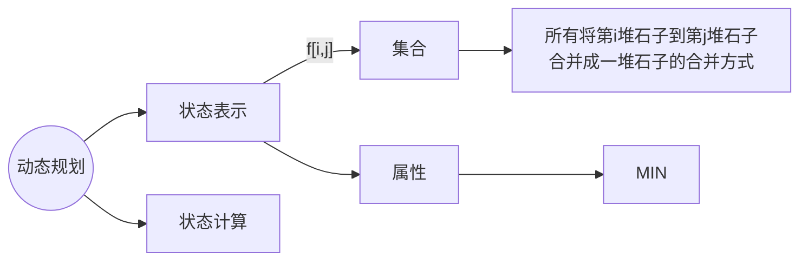
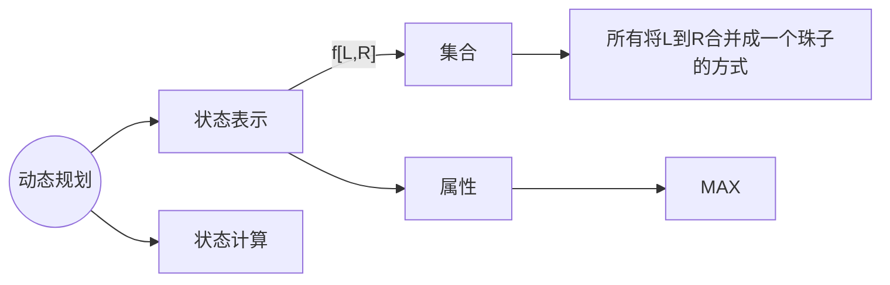
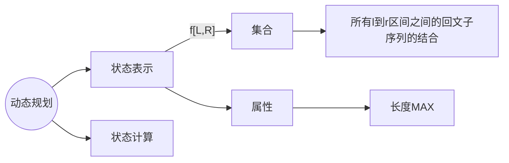

# 区间DP
1. 将环形区间转换为链
2. 记录方案数
3. 区间DP + 高精度
4. 二维区间DP
### 石子合并


以最后一次分界线的位置分类


假设红色分界线位置为 $m$
则左侧是 $[i,m]$ 右侧是 $[m+1,j]$
则最小代价是 $f[i,j] = Min(f[i,m] + f[m+1,j] + s[j] -s[i-1])$
$s[j] -s[i-1]$ 为区间 $[i,j]$ 中石子重量的总和(前缀和)
$m ∈ (i, j)$
$DP$ 两维 $n^2$，又因为要枚举 $k$ 所以时间复杂度 $O(n^2\times n) =O(n^3)$
```cpp
#include<bits/stdc++.h>

using namespace std;

const int N = 350;

int f[N][N];
int n;
int a[N];

int main()
{
    cin >> n;

    for(int i = 1; i <= n; i ++)
    {
        cin >> a[i];
        a[i] += a[i - 1];
    }

    for(int len = 2; len <= n; len ++)
        for(int i = 1; i + len - 1 <= n; i ++)
        {
            int l = i, r = i + len - 1;
            f[l][r] = 1e9;
            for(int k = l; k < r; k ++)
                f[l][r] = min(f[i][r], f[i][k] + f[k + 1][r] + a[r] - a[l - 1]);
        }

    cout << f[1][n] << endl;

    return 0;
}
```
### 环形石子合并
[AcWing 1070](https://www.acwing.com/problem/content/1070/)
对于 n 个石子，如果将两个石子合并，那么就在他们之间连个边，最后连了 n - 1 条边，还剩下一个缺口。所以可以通过将环形拉长一条链，然后枚举缺口来解决问题。然而这个方法时间复杂度高 $O(N^4)$，不可取。

破环成链，从每个口断开都会形成一条链，本质上就是要求 n 条长度为 n 的链上的石子合并问题。

将它转换为长度为 $2n$ 的链

如果从 3 断开，那就转换成 3 ~ 2 的链

可以发现，不管从哪个点断开，形成的链都在这条长度为 2n 的链上，时间复杂度为 $(2n)^3$ 也就是 $O(N^3)$ 
可以用两种方式实现 
1. 迭代式
```cpp
	for(int len = 1; len <= n; len ++)
		for(int L = 1; L + len - 1 <= n; L ++)
			R = L + len - 1;
```

```cpp
#include<bits/stdc++.h>

using namespace std;

const int N = 410, INF = 0x3f3f3f3f;

int n;
int s[N], w[N];
int f[N][N], g[N][N];

int main()
{   
    cin >> n;

    for(int i = 1; i <= n; i ++)
    {
        cin >> w[i];
        w[i + n] = w[i];
    }

    // 前缀和
    for(int i = 1; i <= n * 2; i ++)
        s[i] = s[i - 1] + w[i];

    memset(f, 0x3f, sizeof f);
    memset(g, -0x3f, sizeof g);

    for(int len = 1; len <= n; len ++)
        for(int l = 1; l + len - 1 <= n * 2; l ++)
        {
            int r = l + len - 1;
            if(len == 1)
                f[l][r] = g[l][r] = 0;
            else
            {
                for(int k = l; k < r; k ++)
                {
                    f[l][r] = min(f[l][r], f[l][k] + f[k + 1][r] + s[r] - s[l - 1]);
                    g[l][r] = max(g[l][r], g[l][k] + g[k + 1][r] + s[r] - s[l - 1]);
                }
            }
        }

    int minv = INF;
    int maxv = -INF;

    for(int i = 1; i <= n; i ++)
    {
        minv = min(minv, f[i][i + n - 1]);
        maxv = max(maxv, g[i][i + n - 1]);
    }

    cout << minv << endl << maxv;
    
    return 0;
}
```
2. 记忆化搜索
### [NOIP2006 提高组] 能量项链


和上题类似，展开成 2n 的链，向 1 切一刀，分成 1 ~ 8 ~ 1，区间长度为 n  + 1


### [蓝桥杯 2016 省 A] 密码脱落

相当于是求 总长度 - 最大回文子序列的长度



```c++
#include<bits/stdc++.h>

using namespace std;

const int N = 1050;

char s[N];
int f[N][N];

void solve()
{
    scanf("%s", s);
    int n = strlen(s);

    for(int len = 1; len <= n; len ++)
        for(int l = 0; l + len - 1 < n; l ++)
        {
            int r = l + len - 1;
            if(len == 1)
                f[l][r] = 1;
            else
            {
                if(s[l] == s[r])
                    f[l][r] = f[l + 1][r - 1] + 2;
                if(f[l][r - 1] > f[l][r])
                    f[l][r] = f[l][r - 1];
                if(f[l + 1][r] > f[l][r])
                    f[l][r] = f[l + 1][r];
            }
        }
    
    cout << n - f[0][n - 1];
}

int main()
{
    solve();

    return 0;
}
```

### [蓝桥杯 2023 省 A] 更小的数
[洛谷 P 9232](https://www.luogu.com.cn/problem/P9232)
```cpp
if(s[l] > s[r])
	f[l][r] = 1;
if(s[l] < s[r])
	f[l][r] = 0;
if(s[l] == s[r])
	f[l][r] = f[l + 1][r - 1];
```
可见外面的由里面的子串决定，所以枚举区间长度
```cpp
for(int len = 1; len <= n; len ++){ // 枚举区间长度
	for(int l = 0; l + len - 1 < n; l ++) { // 枚举左端点
	// l + len - 1 实际上就是右端点
	}
}
```

```cpp
#include<bits/stdc++.h>

using namespace std;

const int N = 5e3 + 10;

int f[N][N];

// f[l][r] 表示将 l 到 r 反转后是否符合题意。
// 符合题意为 1，不符合为 0
// 如果第一位大于最后一位，方案合法
// 如果第一位小于最后一位，肯定不合法
// 如果第一位等于最后一位，只要看里面的子串是否合法
string s;
int cnt;

int main()
{
    cin >> s;
    for(int len = 2; len <= s.size(); len ++)
    {
        for(int l = 0; l + len - 1 < s.size(); l ++)
        {
            int r = l + len - 1;

            if(s[l] > s[r])
                f[l][r] = 1;
            else if(s[l] == s[r])
                f[l][r] = f[l + 1][r - 1];

            cnt += f[l][r];
        }
    }

    cout << cnt << endl;

    return 0;
}
```