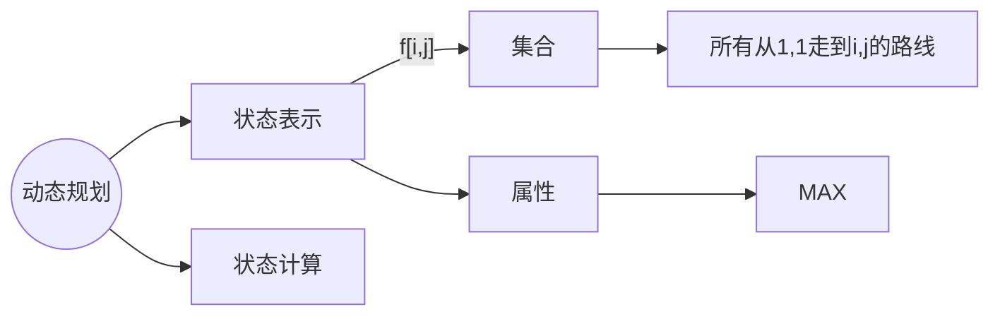
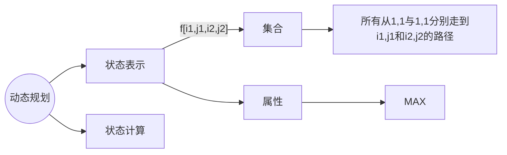
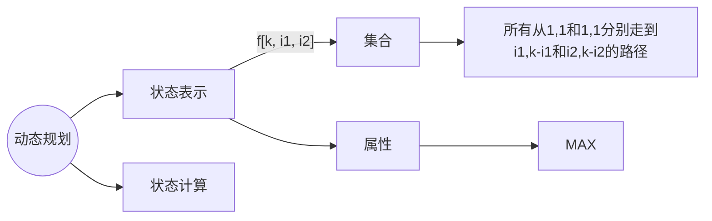

## 摘花生
[原题链接](https://www.acwing.com/problem/content/1017/)

状态计算：集合的划分。(很重要的划分依据：“最后”)
	集合划分依据：1.不重复(但并不是所有情况都要满足) 2.不漏 
	
从 $(1,1)$ 走到 $(i, j)$ 的所有路线的最大值也就是 $f(n, m)$

$f[i, j] = max(f[i - 1, j], f[i, j - 1]) + w[i, j]$
```cpp
#include<bits/stdc++.h>

using namespace std;

const int N = 1e3 + 50;

int f[N][N];
int w[N][N];
int t;

int main()
{
    cin >> t;

    while(t --)
    {
        int r, c;
        cin >> r >> c;
        for(int i = 1; i <= r; i ++)
            for(int j = 1; j <= c; j ++)
                cin >> w[i][j];
        
        for(int i = 1; i <= r; i ++)
            for(int j = 1; j <= c; j ++)
                f[i][j] = max(f[i - 1][j], f[i][j - 1]) + w[i][j];

        cout << f[r][c] << endl;
    }

    return 0;
}
```
## 最低通行费
[原题链接](https://www.acwing.com/problem/content/1020/)
从 "商人必须在 (2N−1) 个单位时间穿越出去。" 得出不能走回头路。
本质上和摘花生这题差不多
```cpp
#include<bits/stdc++.h>

using namespace std;

const int N = 150, INF = 1e9;

int w[N][N], f[N][N];
int n;

int main()
{
    cin >> n;

    for(int i = 1; i <= n; i ++)
        for(int j = 1; j <= n; j ++)
            cin >> w[i][j];
    
    for(int i = 1; i <= n; i ++)
        for(int j = 1; j <= n; j ++)
        {
            if(i == 1 && j == 1)
                f[i][j] = w[i][j];
            else
            {
                f[i][j] = INF;
                if(i > 1)
                    f[i][j] = min(f[i][j], f[i - 1][j] + w[i][j]);
                if(j > 1)
                    f[i][j] = min(f[i][j], f[i][j - 1] + w[i][j]);
            }   
        }
        
    cout << f[n][n] << endl;

    return 0;
}
```

```CPP
#include<bits/stdc++.h>

using namespace std;

const int N = 150, INF = 1e9;

int w[N][N], f[N][N];
int n;

int main()
{
    cin >> n;

    for(int i = 1; i <= n; i ++)
        for(int j = 1; j <= n; j ++)
            cin >> w[i][j];
    
    memset(f, 0x3f, sizeof f);
    f[1][1] = w[1][1];

    for(int i = 1; i <= n; i ++)
        for(int j = 1; j <= n; j ++)
        {
            f[i][j] = min(f[i][j], f[i - 1][j] + w[i][j]);
            f[i][j] = min(f[i][j], f[i][j - 1] + w[i][j]);
        }
        
    cout << f[n][n] << endl;

    return 0;
}
```

## [NOIP2000 提高组] 方格取数
[原题链接](https://www.luogu.com.cn/problem/P1004)


同一个格子不能被重复选择。
只有在 i1 + j1 == i2 + j2 时，两条路径的格子才可能重合。
状态表示可以优化为：f[k, i1, i2]  表示所有从 (1, 1), (1, 1) 分别走到 (i1, k - i1), (i2, k - i2) 的路径的最大值。



第一种情况:
	第一条从 $(1, 1) -> (i_1 - 1, j_1) -> (i_1, j_1)$,
	第二条从 $(1, 1) -> (i_2 - 1, j_2) -> (i_2, j_2)$
	$f[k, i_1, i_2] = max(f[k, i_1, i_2], f[k - 1, i_1-1, i_2-1] + tmp)$
第二种情况：
	第一条从 $(1, 1) -> (i_1 - 1, j_1) -> (i_1, j_1)$,
	第二条从 $(1, 1) -> (i_2, j_2 - 1) -> (i_2, j_2)$
	$f[k, i_1, i_2] = max(f[k, i_1, i_2], f[k - 1, i_1-1, i_2] + tmp)$
第三种情况：
	第一条从 $(1, 1) -> (i_1, j_1 - 1) -> (i_1, j_1)$,
	第二条从 $(1, 1) -> (i_2 - 1, j_2) -> (i_2, j_2)$
	$f[k, i_1, i_2] = max(f[k, i_1, i_2], f[k - 1, i_1, i_2-1] + tmp)$
第四种情况：
	第一条从 $(1, 1) -> (i_1, j_1 - 1) -> (i_1, j_1)$,
	第二条从 $(1, 1) -> (i_2, j_2 - 1) -> (i_2, j_2)$
	$f[k, i_1, i_2] = max(f[k, i_1, i_2], f[k - 1, i_1, i_2] + tmp)$

如果两个格子重合 $tmp = w[i_1,j_1]$
	不重合则 $tmp = w[i_1, j_1] + w[i_2, j_2]$

$i_1==i_2$ 代表两个格子重合
```cpp
#include<bits/stdc++.h>

using namespace std;

const int N = 15;

int f[N * 2][N][N];
int w[N][N];
int n;

int main()
{
    cin >> n;

    int a, b, c;
    while(cin >> a >> b >> c, a || b || c)
        w[a][b] = c;

    for(int k = 2; k <= n + n; k ++)
        for(int i1 = 1; i1 <= n; i1 ++)
            for(int i2 = 1; i2 <= n; i2 ++)
            {
                int j1 = k - i1;
                int j2 = k - i2;
                if(j1 >= 1 && j1 <= n && j2 >= 1 && j2 <= n)
                {
                    int tmp = w[i1][j1];
                    if(i1 != i2)
                        tmp += w[i2][j2];
                    int &ff = f[k][i1][i2];
                    ff = max(ff, f[k - 1][i1 - 1][i2 - 1] + tmp);
                    ff = max(ff, f[k - 1][i1 - 1][i2] + tmp);
                    ff = max(ff, f[k - 1][i1][i2 - 1] + tmp);
                    ff = max(ff, f[k - 1][i1][i2] + tmp);
                }
            }

    cout << f[n + n][n][n];

    return 0;
}
```
