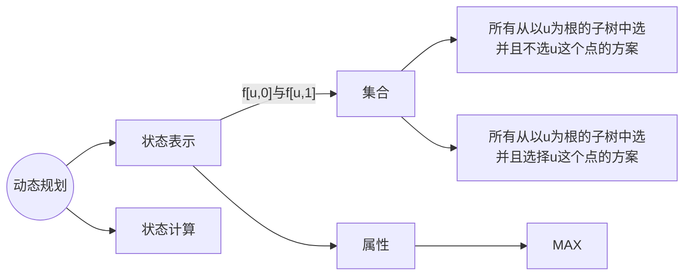

# **树形DP**

## **没有上司的舞会**




f[u, 0] 表示不选 u 这个根节点。如果不选的话(s 为儿子节点)
$f[u][0]=\sum max(f[s_i,0],f[s_i,1])$
f[u, 0] 表示选 u，如果父亲节点被选了，那么儿子节点就不能再选了
$f[u][1]=\sum f(s_i,0)$
时间复杂度为 $O(n)$

```cpp
#include<bits/stdc++.h>

using namespace std;

const int N = 6010;

int n;
int happy[N];
int h[N], e[N], ne[N], idx;
int f[N][2];
bool has_father[N];

void add(int a, int b)
{
    e[idx] = b;
    ne[idx] = h[a];
    h[a] = idx ++;
}

void dfs(int u)
{
    f[u][1] = happy[u];
    
    for(int i = h[u]; i != -1; i = ne[i])
    {
        int j = e[i];
        dfs(j);
        
        f[u][0] += max(f[j][0], f[j][1]);
        f[u][1] += f[j][0];
    }
}

int main()
{
    cin >> n;
    for(int i = 1; i <= n; i ++)
        cin >> happy[i];

    memset(h, -1, sizeof h);

    for(int i = 0; i < n - 1; i ++)
    {
        int a, b;
        cin >> a >> b;
        has_father[a] = true;
        add(b, a);
    }
    
    int root = 1;
    while(has_father[root]) root ++;

    dfs(root);
    
    cout << max(f[root][0], f[root][1]);

    return 0;
}
```

