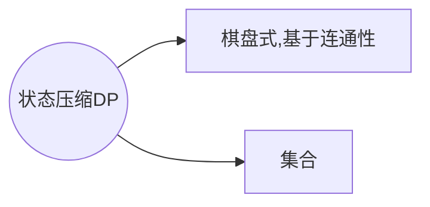
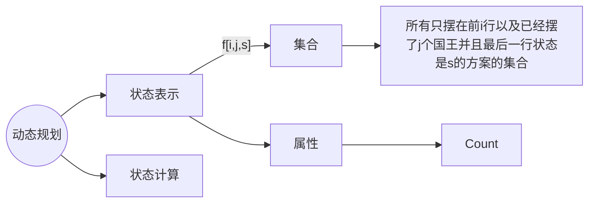

# 状态压缩DP

## 二进制压缩

### **蒙德里安的梦想**

#### 核心：
先放横着的，再放竖着的
总方案数等于只放横着的小方块的合法方案数。
#### 如何判断当前方案是否合法：
​	所有剩余位置，能否填充满竖着的小方块。可以按列来看，每一列内部所有连续的空着的小方块需要是偶数个

考虑按列摆放，某列的各行用 $0$ 或 $1$ 

第一列状态表示 $1001$

第二列状态表示$0110$​

1. 状态表示：$f[i, j]$ 表示摆放第 $i$ 列，状态为 $j$ 时的方案数
   状态转移: $f[i - 1,k] -> f[i,j]$ 
   即从第 $i - 2$ 列伸到第 $i-1$ 列的状态为 $k$ 的所有方案数
      $0000->0011$
       
   
    
   $1100-0011$
1. 状态计算：$f[i,j] = \sum f[i-1,k]$
2. 初值：$f[0,0] = 1$ 不放横着的矩形方案数是 $1$，其他均为 $0$
3. 目标：$f[m,0]$ 已经摆完了第 $m$ 列，不向其它列伸出	
$\textcolor{red}{注意}$

这是 **错误** 的摆放方式，$k$ 和 $j$ 不能在同一行，因为从        $~~i - 1$  到 $i$ 已经放置了 $1 \times 2 $ 的方块，如果再从 $i-2$ 进     行放置，那就会形成一个 $1 \times 3$ 的方块，不符合题意
```c++
(k & j) == 0
//如果有 1 位相同结果就不是 0，所以改行表示 k 和 j 没有 1 行相同
```

```c++
#include<iostream>
#include<cstring>
#include<algorithm>
#include<vector>

using namespace std;

typedef long long LL;

const int N = 12, M = 1 << N;

int n, m;
LL f[N][M]; //第一维表示列，第二维表示所有可能的状态
vector<int> state[M];
bool st[M]; //存储每种状态是否有奇数个连续的 0
            //如果是奇数个 0 ，则不符合题意。如果是偶数个 0 则为 true

int main()
{
    while(cin >> n >> m, n || m)
    //读入，并且不是两个 0 就继续读入
    //因为题目中以 0 0 截止
    {
        //预处理，每种状态先预处理不能有奇数个连续 0
        for(int i = 0; i < 1 << n; i ++)
        {
            int cnt = 0; //记录连续的 0 的个数
            bool is_valid = true; //没有奇数个连续的 0
            for(int j = 0; j < n; j ++) //从上到下遍历一列
            {
                if(i >> j & 1)
                //如果 i 的二进制数的第 j 位是 1
                {
                    if(cnt & 1)
                    //如果这一位是 1 并且前面是奇数个连续的 0 则不合法
                    {
                        is_valid = false;
                        break;
                    }
                    cnt = 0;
                }
                //如果第 j 位是 0，则计数器继续统计连续的 0 的个数
                else
                    cnt ++;
            }
            //最后再判断一下连续 0 的个数
            if(cnt & 1)
                is_valid = false;
            //状态 i 是否有奇数个连续的 0 的情况
            st[i] = is_valid;
        }

        //进一步预处理
        //判断是否有从 i - 2 位伸出和从 i - 1 位伸出是否冲突 
        for(int i = 0; i < 1 << n; i ++)
        //对于第 i 列的所有状态
        {
            state[i].clear(); //清空上次操作的结果
            for(int j = 0; j < 1 << n; j ++)
            //对于第 i - 1 列的所有状态
            {
                //从第 i - 2 列伸出的与从第 i - 1 列伸出的不在一行
                //并且还要考虑从第 i - 2 列插到第 i - 1 列的
                //以及从第 i - 1 列插到第 i 列
                //合在一起是否会有连续的奇数个 0
                // i | j 就是将它们的二进制数合并
                //表示第 i - 1 有多少个 1 和 0
                if((i & j) == 0 && st[i | j])
                    state[i].push_back(j);
                //既没有两列伸出冲突的有没有连续奇数个 0 的
                //第 i 列真正可行的第 i - 1 列的状态 
            }
        }

        //初始化
        memset(f, 0, sizeof f);
        f[0][0] = 1;
        //不放横着的矩形的方案数是 1，其他都是 0 

        for(int i = 1; i <= m; i ++) //遍历每一列
            for(int j = 0; j < 1 << n; j ++) //遍历当前列 i 的所有状态
                for(auto k : state[j]) //遍历第 i - 1 列的可行的状态
                    f[i][j] +=f[i - 1][k];
                    //当前列的方案数等于之前的第 i - 1 列所有状态 k 的累加

        //处理到最后一列并且不向别的列伸出
        cout << f[m][0] << endl;
    } 
    return 0;
}
```
### [SCOI2005] 互不侵犯
[洛谷 P1896](https://www.luogu.com.cn/problem/P1896)
#### 方法1
当我们摆完第一行，第二行能否摆放国王，要根据第一行摆放情况。也就是说某一行摆放情况依赖于上一行。

我们可以用二进制状态表示是否放置了国王。
若对于第 $i - 1$ 行，状态是 $S1: ~000100$ 
则对于第 $i$ 行，状态 $S2$ 非法情况: $000100$  $001000$ $000010$

若一行的第 $j$ 列放置了国王，那么下面一列的 $j - 1 、 j、j + 1$ 列都不能放置国王

因此 可以进行位运算判断

判断第 $j$ 列
​	若 $S1 ~\& ~S2 \ne 0$ 则说明 $S2$ 存在一列的 $1$ 和 $S1$ 的 $1$ 冲突，也就是说明国王放置不恰当

判断第 $j - 1$ 列
​	可以将 $S2$ 整体往左平移一个单位，这样的话原先第 $j$ 列的国王就可以和现在第 $j - 1$ 列的状态对应，若 $S1~ \& ~(S2 >> 1)\ne 0$ 则说明此时的 $S2$ 的第 $j - 1$ 列存在国王，则放置非法

判断第 $j + 1$ 列
​	可以将 $S2$ 整体向右平移一个单位，若 $S1 ~\& ~ (S2 << 1) \ne 0$ 则说明 $S2$ 的第 $j + 1$ 列放置了国王，则非法

所以能合法的情况是
$((S2 >> 1)~\& S1 = 0)~ \&\& ((S2 << 1) ~\&~ S1 = 0) ~\&\& ~(S1 ~\&~ S2 = 0)$

同时，对于同一行的国王，一列的国王的左右不能放置国王

可以将 $S2$ 往右与往右移动一位，再与原先的 $S2$ $\&$ 运算
$((S2 << 1) ~\& ~S2  = 0) ~\&\&~ ((S2 >> 1) ~\&~ S2 = 0)$
#### 方法2



### **最短Hamilton路径**


$i$ 是一个二进制数，例如 $(1110011)_{b}$，哪个点是 $1$ 就代表走过
分类：倒数第二个点为哪个点

假设为点 k 
那么就是从 0 -> k -> j 
从 k 到 j 走的路径固定。要求从 0 到 j 最短， 也就是求从 0 到 k
$f[0, j] = f[i - {j}, k] + a[k, j]$
```cpp
#include<bits/stdc++.h>

using namespace std;

const int N = 20, M = 1 << N;

int n;
int w[N][N];
int f[M][N];

int main()
{
    cin >> n;
    for(int i = 0; i < n; i ++)
        for(int j = 0; j < n; j ++)
            cin >> w[i][j];
    
    memset(f, 0x3f, sizeof f);
    f[1][0] = 0;
    for(int i = 0; i < 1 << n; i ++)
        for(int j = 0; j < n; j ++)
            if(i >> j & 1) // 路径包含 j 这个点
                for(int k = 0; k < n; k ++)
                    if((i - (1 << j)) >> k & 1) // 包含 k 这个点
                        f[i][j] = min(f[i][j], f[i - (1 << j)][k] + w[k][j]);
                            // [i - (1 << j)] 表示 j 未走过
    
    cout << f[(1 << n) - 1][n - 1] << endl; // (1 << n) - 1 是因为一开始就为 1，要除掉

    return 0;
}
```

