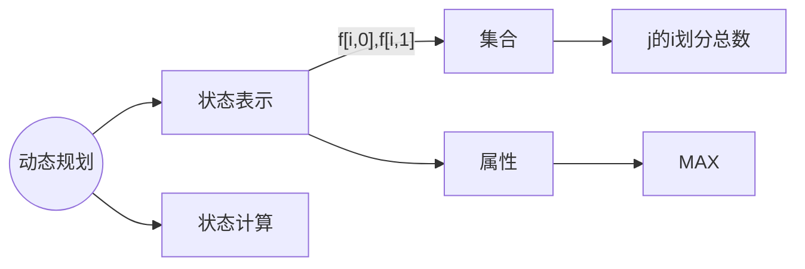
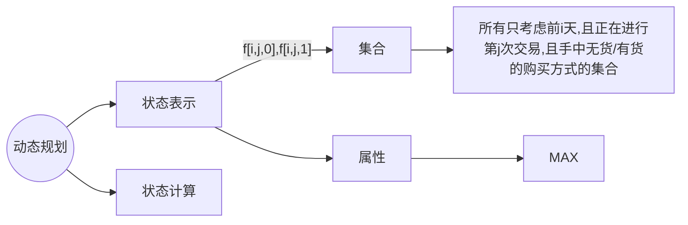

[AcWing 1051](https://www.acwing.com/problem/content/1051/)
用 f\[i]  表示获得的最多现金数量。
如果用背包模型来分析。

如果用状态机模型的思路。可以把每个 f\[i] 分解为 2 个状态，也就是 f(i, 0), f(i, 1)。f(i, 0) 表示当前的店铺没有被抢劫。f(i, 1) 表示选择这个店铺。

状态可以表示为：




也可以看成：

```cpp
#include<bits/stdc++.h>

using namespace std;

const int N = 1e5 + 10, INF = 0x3f3f3f3f;

int w[N], f[N][2];
int T;
int n;

int main()
{
    cin >> T;

    while(T --)
    {
        cin >> n;
        for(int i = 1; i <= n; i ++)
            cin >> w[i];
        f[0][0] = 0, f[0][1] = -INF;
        
        for(int i = 1; i <= n; i ++)
        {
            f[i][0] = max(f[i - 1][0], f[i - 1][1]);
            f[i][1] = f[i - 1][0] + w[i];
        }   

        cout << max(f[n][0], f[n][1]) << endl;
    }

    return 0;
}
```
### 股票买卖IV
[AcWing 1059](https://www.acwing.com/problem/content/1059/)
股票状态机


买入相当于是开始新的交易，卖出相当于是交易结束。

$f[i, j, 0] = max(f[i - 1, j, 0], f[i - 1, j, 1] + w[i]$
$f[i, j, 1] = max(f[i - 1, j, 1], f[i - 1, j - 1, 0] - w[i])$
```cpp
#include<bits/stdc++.h>

using namespace std;

const int N = 1e5 + 10, M = 110, INF = 0x3f3f3f3f;

int n, m;
int w[N];
int f[N][M][2];

int main()
{   
    cin >> n >> m;

    for(int i = 1; i <= n; i ++)
        cin >> w[i];
    
    memset(f, -0x3f, sizeof f);
    for(int i = 0; i <= n; i ++)
        f[i][0][0] = 0; // 一次交易都没进行

    for(int i = 1; i <= n; i ++)
    {
        for(int j = 1; j <= m; j ++)
        {
            f[i][j][0] = max(f[i - 1][j][0], f[i - 1][j][1] + w[i]);
            f[i][j][1] = max(f[i - 1][j][1], f[i - 1][j - 1][0] - w[i]);
        }
    }

    int res = 0;
    for(int i = 0; i <= m; i ++)
        res = max(res, f[n][i][0]);
        
    cout << res << endl;

    return 0;
}
```

### 股票买卖 V
[AcWing 1060](https://www.acwing.com/problem/content/1060/)

$f[i][0]$ 表示走过了前 i 天且手中有货的状态
$f[i][1]$ 表示走过了前 i 天且是手中无货第一天的状态
$f[i][2]$ 表示走过了前 i 天且是手中无货第 >= 2 天的状态

$f[i, 0] = max(f[i - 1, 0], f[i - 1, 2] - w[i])$
$f[i, 1] = f[i - 1, 0] + w[i]$
$f[i, 2] = max(f[i - 1. 1], f[i - 1, 2])$
初始化:
	$f[0, 2] = 0$
	$f[0, 1] = f[0, 0] = - \infty$
```cpp
#include<bits/stdc++.h>

using namespace std;

const int N = 1e5 + 10, INF = 0x3f3f3f3f;

int n;
int w[N];
int f[N][3];

int main()
{   
    cin >> n;

    f[0][0] = f[0][1] = -INF;
    f[0][2] = 0;
    
    for(int i = 1; i <= n; i ++)
        cin >> w[i];

    for(int i = 1; i <= n; i ++)
    {
        f[i][0] = max(f[i - 1][0], f[i - 1][2] - w[i]);
        f[i][1] = f[i - 1][0] + w[i];
        f[i][2] = max(f[i - 1][1], f[i - 1][2]);
    }

    cout << max(f[n][1], f[n][2]) << endl;

    return 0;
}
```
最后输出取 max 是因为如果股票的价格是单调下降的，那么最好的方案是一次交易都不做。那最后就是 f\[n]\[2].
