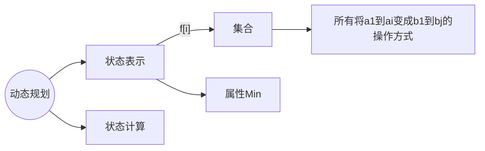

# **线性DP**


## **数字三角形**


 


可以将从起点到终点的所有路径分成两类：

1. 从**左上方**来的路径 $f[i - 1][j - 1]$
2. 从**右上方**来的路径 $f[i - 1][j]$

$f[i][j] = max(f[i - 1][j - 1] + a[i][j], f[i - 1][j] + a[i][j])$

一般涉及到 $i - 1$ ，下标从 $1$ 开始

$\textcolor{red}{注意边界的初始化,要多往右和往左初始化一个（初始化为负无穷是因为输入的数据里面会有负数）}$

```c++
for(int i = 0; i <= n; i ++)
    for(int j = 0; j <= i + 1; j ++)
        f[i][j] = -INF;
```

完整代码

```c++
#include<iostream>
#include<algorithm>

using namespace std;

const int N = 550, INF = 1e9;

int a[N][N], f[N][N];

int main()
{
    int n;
    cin >> n;
    for(int i = 1; i <= n; i ++)
        for(int j = 1; j <= i; j ++)
            cin >> a[i][j];

    for(int i = 0; i <= n; i ++)
        for(int j = 0; j <= i + 1; j ++)
            f[i][j] = -INF;
    
    f[1][1] = a[1][1];

    for(int i = 2; i <= n; i ++)
        for(int j = 1; j <= i; j ++)
            f[i][j] = max(f[i - 1][j - 1] + a[i][j], f[i - 1][j] + a[i][j]);

    int res = -INF;
    for(int i = 1; i <= n; i ++)
        res = max(res, f[n][i]);

    cout << res << endl;
    return 0;
}
```

## **最长上升子序列**

> 字符子串指的是连续的，子序列是一个字符串中非连续的字串


第 $i$ 个数可以以第 $i - 1$ 个数来分类

最多有 $i$ 种情况

第一类是没有第 $i - 1$ 个数，序列长度为 $1$

第二类是倒数第二个数是第 $1$ 个数，序列长度为 $2$

第三类是倒数第二个数是第 $2$ 个数

...

最后一类是是倒数第二个数是第 $i - 1$ 个数


#### 时间复杂度$O(n^2)$

```c++
#include<iostream>
#include<algorithm>

using namespace std;

const int N = 1010;

int n;
int a[N], f[N];

int main()
{
    scanf("%d", &n);
    for(int i = 1; i <= n; i ++)
        scanf("%d", &a[i]);

    for(int i = 1; i <= n; i ++)
    {
        f[i] = 1; //只有 i 一个数，即没有第 i - 1 个数，前面没有比 a[i] 小的
        for(int j = 1; j < i; j ++) //倒数第二个数是第 1,2,...,i-1 个数的情况
            if(a[j] < a[i])
                //如果还能构成上升的序列
                f[i] = max(f[i], f[j] + 1);
    }

    int res = 0;
    for(int i = 1; i <= n; i ++)
        res = max(res,f[i]);

    cout << res << endl;
    return 0;
}
```

### **输出路径**

用动态规划记录路径

##### **倒序输出**

```c++
#include<iostream>
#include<algorithm>

using namespace std;

const int N = 1010;

int n;
int a[N], f[N], g[N]; //g 数组保存转移

int main()
{
    scanf("%d", &n);
    for(int i = 1; i <= n; i ++)
        scanf("%d", &a[i]);

    for(int i = 1; i <= n; i ++)
    {
        f[i] = 1; 
        g[i] = 0; //表示只有一个数
        for(int j = 1; j < i; j ++) 
            if(a[j] < a[i])
                if(f[j] + 1 > f[i])
                {
                    f[i] = f[j] + 1;
                    g[i] = j; //记录状态是从哪个转移过来的
                }
    }

    int k = 1;
    //找到最长上升子序列的最后一个元素的位置 k，即最长上升子序列的结束位置
    for(int i = 1; i <= n; i ++)
        if(f[k] < f[i])
            k = i;

    printf("%d\n", f[k]);

    //倒序输出最长上升子序列，从 k 开始向前遍历
    for(int i = 0, len = f[k]; i < len; i ++)
    {
        cout << a[k] << " ";
        k = g[k];
    }

    return 0;
}
```

#### **正序输出**

用一个链表存储

```c++
int lisLength = f[k];
int lis[N];
int idx = 0;
while (k != 0)
{
    lis[idx++] = a[k];
    k = g[k];
}

// 输出正序最长上升子序列
for (int i = lisLength - 1; i >= 0; i--)
{
    cout << lis[i] << " ";
}
```

### 优化做法

将集合 $dp[i]$ 表示成长度为 $i$ 的上升子序列的最小末尾数值

#### 时间复杂度$O(logn)$

```cpp
#include<bits/stdc++.h>

using namespace std;

const int N = 100010;

int n;
int a[N];
int q[N];

int main()
{
    cin >> n;

    for(int i = 0; i < n; i ++)
        cin >> a[i];
    int len = 0;
    q[0] = -2e9;
    for(int i = 0; i < n; i ++)
    {
        int l = 0, r = len;
        while(l < r)
        {
            int mid = l + r + 1 >> 1;
            if(q[mid] < a[i])
                l = mid;
            else r = mid - 1;
        }
        len = max(len, r + 1);
        q[r + 1] = a[i];
    }

    cout << len << endl;

    return 0;
}
```


## **最长公共子序列**


分别对应 $a[i] ,b[j]$ 选或不选


f[i - 1, j] 与 f[i, j - 1] 实际上并不能正确表示，但是是包含在 f[i, j] 中的，所以直接去 max 就可以
```cpp
#include<bits/stdc++.h>

using namespace std;

const int N = 1050;

int n, m;
char a[N], b[N];
int f[N][N];

int main()
{
    cin >> n >> m;

    scanf("%s%s", a + 1, b + 1);

    for(int i = 1; i <= n; i ++)
    {
        for(int j = 1; j <= m; j ++)
        {
            f[i][j] = max(f[i - 1][j], f[i][j - 1]);
            if(a[i] == b[j])
            {
                f[i][j] = max(f[i][j], f[i - 1][j - 1] + 1);
            }
        }
    }

    cout << f[n][m] << endl;
    
    return 0;
}
```

## **最短截断距离**





如果要删掉第 i 个数，那么前 i - 1 个数得与 b 中前 j 个数相同
如果要添加一个数，那么最后添加的数应该和 b[j] 相同，添加前 a[1 ~ i] 与 b[1 ~ j - 1] 已经匹配
如果要修改，应该把 a[i] 改成 b[j]。如果已经相等则不需要修改。前提是 a[1 ~ i - 1] 已经与 b[1 ~ j - 1] 匹配
$f[i,j]=MIN(f[i-1,j]+1,f[i,j-1]+1,f[i-1,j-1]+1~or~0)$
```cpp
#include<bits/stdc++.h>

using namespace std;

const int N = 1050;

int n, m;
char a[N], b[N];
int f[N][N];

int main()
{
    scanf("%d%s", &n, a + 1);
    scanf("%d%s", &m, b + 1);
    
    // a 长度为 0, 那么就是增加 b 的字符串长度次
    for(int i = 0 ; i <= m; i ++)
        f[0][i] = i;
        
    // b 长度为 0, 那么就是增加 a 的字符串长度次
    for(int i = 0; i <= n; i ++)
        f[i][0] = i;

    for(int i = 1; i <= n; i ++)
    {
        for(int j = 1; j <= m; j ++)
        {
            f[i][j] = min(f[i - 1][j] + 1, f[i][j - 1] + 1);
            if(a[i] == b[j])
                f[i][j] = min(f[i][j], f[i - 1][j - 1]);
            else
                f[i][j] = min(f[i][j], f[i - 1][j - 1] + 1);
        }
	}
  
    cout << f[n][m] << endl;

    return 0;
}
```