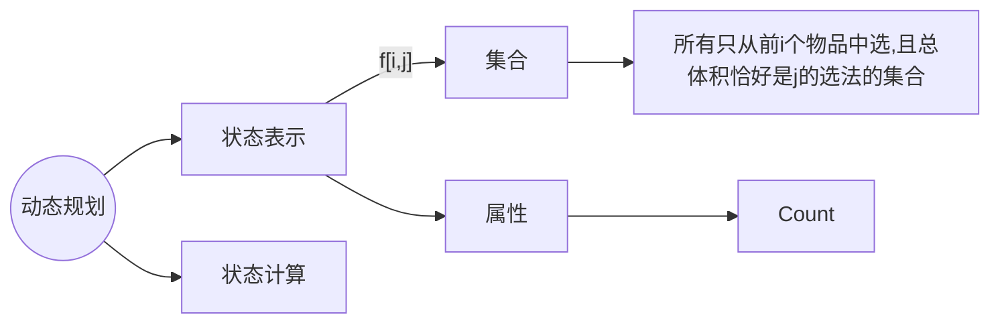
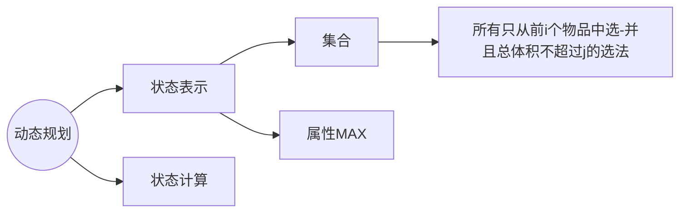
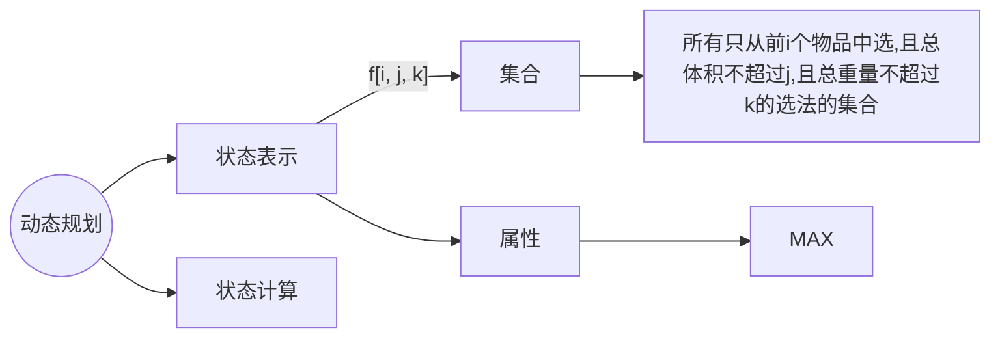
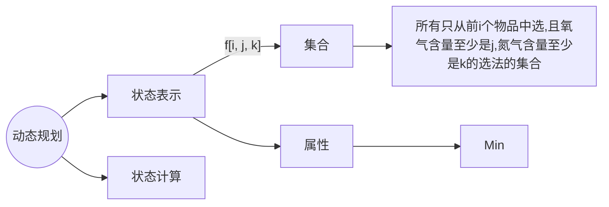
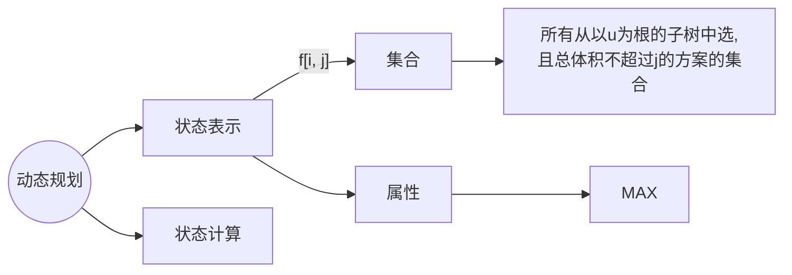

# **背包问题**

$DP$ 从两个角度来考虑 ： **状态表示** **$f ( i, j )$** 与 **状态计算**

状态表示 **$f ( i, j )$** 从 **集合** 和 **属性**$（ max, min, num )$ 考虑

$DP$ 优化一般是对动态规划的代码或者方程做一个等价变形

$N$ 个物品 和一个容量是 $V$ 的背包，每个物品有 $2$ 个属性，一个是他的体积 $v_{i}$，还有个是他的价值 $w_{i}$

从集合角度考虑分为

1. 所有选法
2. 条件
   1. 只从前 $i$ 个物品中选
   2. 总体积 $<= j$

$f(i, j)$ 表示只从前 $i$ 个物品中选并且总体积 ≤ $j$ 的选法的集合，它存的数是里面每一个选法的总价值的最大值

--> $f(N, V)$

状态计算 对应 集合的划分


**原则**：
1. 不重 
2. **不漏**

**不含 $i$** : 
	相当于从 $1 \sim i - 1$ 中选，总体积不超过 $j$ 的集合， 即 **$f( i - 1 , j )$**
**含 $i$** : 
	先去掉第 $i$ 个，然后从 $1 \sim i - 1$ 中选，且总体积不超过  $j - v_{i}$，即 $f ( i -1 , j - vi )$，最后再加上第 $i$ 个物品的价值 $w_{i}$，即 **$f ( i -1 , j - vi ) + wi$**

因此，**$f ( i , j ) = max( f ( i - 1 , j ) , f ( i - 1 , j - vi ) + wi )$**

## 0 1 背包问题

**$\textcolor{red}{每件物品只能用一次}$**，可以选择放或不放	


$f[i][v]$ 表示前 $i$ 件物品恰好放入一个容量为 $v$ 的背包可以获得的最大价值

状态转移方程 $f[i][v] = max(f[i-1][v], f[i - 1][v - c[i]] + w[i])$

如果只考虑第 $i$ 件物品放或不放，就可以转换成前关于 $i - 1$ 件物品的问题，如果不放第 $i$ 件物品，那么就是前 $i - 1$ 件物品放入容量为 $v$ 的背包种，价值为 $f[i - 1][v]$;如果放入第 $i$ 件物品，那么就转换成前 $i - 1$ 件物品放入剩下的容量为 $v - c[i]$ 的背包中，此时能获得的最大价值就是 $f[i- 1][v - c[i]] + w[i]$

### 时间复杂度$O(nm)$

```c++
#include<iostream>
#include<algorithm>

using namespace std;

const int N = 1010;

int n, m;
int v[N], w[N];
int f[N][N];

int main()
{
    cin >> n >> m;

    for( int i = 1; i <= n; i ++ ) cin >> v[i] >> w[i];

    for(int i = 1; i <= n; i ++ )
        for(int j = 1; j <= m; j++)
        {
            f[i][j] = f[i - 1][j];
            //左边一定存在
            if( j >= v[i] )
                f[i][j] = max(f[i][j], f[i - 1][j - v[i]] + w[i]);
            //右边不一定存在，可能为空集，即当 j < v[i] 时，装不下
        }
    cout << f[n][m] << endl;
    return 0;
}
```

### 优化为一维

因为 $f[i][j] = f[i - 1][j];$

​    $f[i][j] = max(f[i][j], f[i - 1][j - v[i]] + w[i]);$

$f(i)$ 只用到了 $f( i - 1 )$

又因为 $j - vi  ≤ j$

改成一维f表示

```c++
for(int i = 1; i <= n; i ++)
	for(int j = v[i]; j <= m; j ++)
	{
		f[j] = max(f[j], f[j - v[i]] + w[i]);
	}
```

$f[j] = max(f[j], f[j - v[i]] + w[i])$

$\textcolor{red}{错误}$

如果顺序遍历的话 $f[j]$ 会被前面的状态所影响。

因为 $j - v[i] < j$ ，它已经在 $f [ j ]$ 之前被计算过了，在第 i 层已经被计算，所以这样是**等价于** $f[ i ] [ j - v[ i ]] + w[i]$

但我们实际上应该是 $f[ i - 1 ] [ j - v[ i ]] + w[i]$

应该让 $j$ 倒着遍历

```c++
for(int i = 1; i <= n; i ++)
	for(int j = m; j >= v[i]; j --)
	{
		f[j] = max(f[j], f[j - v[i]] + w[i]);
	}
```

让 $j$ 倒着遍历，在计算 $f[j]$ 时，$f[j - v[i]]$ 还没有被更新过，所以存的是第 $i - 1$ 层的 $j - v[i]$

即这样才表示 **$f[i][j] = max(f[i][j], f[ i - 1 ] [ j - v[ i ]] + w[i])$**

#### **01背包问题空间优化的原理是：**

我们其实还是进行双重循环

1. 外层for还是用来遍历原来二维数组的每一行（虽然现在已经没有二维数组了，但是表示的还是这个意义，只不过是用一维数组一直通过外层循环将每一行的值更新）

2. 内层循环就是在更新二维数组（同上一个括号内的说法）的每一行中的每一列的值。

3. 因此我们还想用上一行的值得时候，就不能从前往后了，要从后往前，更新某行最后一个值的时候，其实前面的值存储的还是上一行的所有值，所以不受影响。

### 数字组合
[原题链接](https://www.acwing.com/problem/content/280/)
把 M 看成背包容量，把每个数看成一个物品， Ai 看成是体积。
目标：求出总体积恰好是 M 的方案数


$f[i, j] = f[i - 1, j] + f[i - 1, j - v[i]]$
```cpp
#include <bits/stdc++.h>

using namespace std;

const int N = 150, M = 1e4 + 50;

int f[M];
int v[N];
int n, m;

int main()
{
    cin >> n >> m;

    for(int i = 1; i <= n; i ++)
        cin >> v[i];

    f[0] = 1;
    for(int i = 1; i <= n; i ++)
        for(int j = m; j >= v[i]; j --)
            f[j] = f[j] + f[j - v[i]];

    cout << f[m] << endl;

    return 0;
}
```
## 完全背包问题

**$\textcolor{red}{每件物品有无限个}$**

**状态表示** $f [ i , j ]$ 
	**集合**：所有只考虑前 $i$ 个物品，且总体积不大于 $j$ 的所有选法
​	   **属性**：$MAX$

状态计算

​	 **集合的划分**


第 $i$ 个物品选 $0$ 个相当于从 $i - 1$ 个物品中选，相当于$f[i - 1][j]$
**曲线救国**
1. 去掉 $k$ 个物品 $i$
2. 求 $MAX$，$f [ i - 1 , j - k * v[ i ] ]$
3. 再加回来 $k$ 个物品 $i$
--> $f [ i - 1 , j - k * v[ i ] ] + k * w[ i ]$

$0$：第 $i$ 个物品选 $0$ 个，相当于 $f [ i - 1 ,  j ]$
所以合在一起
就是 $f [ i , j ] = f [ i - 1 , j - v [ i ] * k ] + w [ i ] * k$
### **朴素做法**
```c++
#include<iostream>
#include<algorithm>

using namespace std;

const int N = 1010;

int n, m;
int v[N], w[N];
int f[N][N];

int main()
{
    cin >> n >> m;
    for(int i = 1; i <= n; i++) cin >> v[i] >> w[i];
    for(int i = 1; i <= n; i++)
        for(int j = 0; j <= m; j++)
            for(int k = 0; k * v[i] <= j; k++) //体积有限制
                    f[i][j] = max(f[i][j], f[i - 1][j - v[i] * k] + w[i] * k);
    cout << f[n][m] << endl;
    return 0;
}
```
### **优化版本**
$f[i,j] = Max(f[i - 1, j], f[i - 1, j - v] + w, f[i - 1, j - 2v] + 2w, f[i - 1, j - 3v] + 3w ,..., f[i - 1, j - sv] + sw), s = j /v$ 
$f[i,j - v] = Max(~~~~~~~~~~~f[i - 1, j - v], f[i - 1, j - 2v] + w, f[i - 1, j - 3v] + 2w, ..., f[i - 1, j - sv] + (s-1)w), s = j /v)$
可以看出来第一条式子和第二条式子很相近

$Max(f[i - 1, j - v] + w, f[i - 1, j - 2v] + 2w, f[i - 1, j - 3v] + 3w ,...) = f[i, j - v] + w$
所以
$f [ i , j ] = Max( f [ i - 1, j ], f [ i , j - v ] + w )$
```c++
 for(int i = 1; i <= n; i++) cin >> v[i] >> w[i];
    for(int i = 1; i <= n; i++)
        for(int j = 0; j <= m; j++)
        {
            f[i][j] = f[i - 1][j];
            if( j >= v[i])
                f[i][j] = max( f[i][j], f[i][j - v[i]] + w[i] );
        }
```
<!-- 因为上面已经让 f[i][j] = f[i - 1][j]; 所以在 max 语句中可以直接写成 f[i][j] -->

### **再度优化（一维）**

$f [ i , j ] = Max( f [ i, j ], f [ i , j - v ] + w )$

因为都是在第 $i$ 层，所以可以直接删掉变成

$f [ j ] = Max( f [ j ], f [ j - v ] + w )$

同时，因为是在第 $i - 1$ 层，所以 $j$ 不用倒序

```c++
#include<iostream>
#include<algorithm>

using namespace std;

const int N = 1010;

int n, m;
int v[N], w[N];
int f[N];

int main()
{
    cin >> n >> m;
    for(int i = 1; i <= n; i++) cin >> v[i] >> w[i];
    
    for(int i = 1; i <= n; i++)
        for(int j = v[i]; j <= m; j++)
            f[j] = max(f[j], f[j - v[i]] + w[i]); // f[j - v[i]] 实际上是 f[i][j - v[i]]
    cout << f[m] << endl;
    return 0;
}
```
当空间优化为 1 维之后，只有完全背包问题的体积是从小到大循环的。

用 f\[i]\[j] 而不是 f\[i - 1]\[j] [链接](https://www.acwing.com/problem/content/discussion/content/6669/)
### # [NOIP2018 提高组] 货币系统
[洛谷P5020](https://www.luogu.com.cn/problem/P5020)
性质 1: $a_1, a_2, ..., a_n$ 一定都可以被表示出来
性质 2: 在最优解中， $b_1, b_2, ..., b_m$ 一定都是从 $a_1, a_2, ..., a_n$ 中选择的
性质 3: $b_1, b_2, ..., b_m$ 一定不能被其他 $b_i$ 表示出来
对于每个数 $a_i$，有两种情况，一种是可以被表示，那么它一定不能选。另一种是不可被表示，那么它一定要选。
```cpp
#include<bits/stdc++.h>

using namespace std;

const int N = 110, M = 25010;

int n;
int a[N];
int f[M];

int main()
{
    int t;
    cin >> t;

    while(t --)
    {
        cin >> n;
        int cnt = 0;

        for(int i = 0; i < n; i ++)
            cin >> a[i];

        sort(a, a + n);

        int m = a[n - 1];
        memset(f, 0, sizeof f);
        f[0] = 1;
        for(int i = 0; i < n; i ++)
        {
            if(!f[a[i]])
                cnt ++;
            for(int j = a[i]; j <= m; j ++)
                f[j] += f[j - a[i]];
        }

        cout << cnt << endl;
    }

    return 0;
}
```
## 多重背包问题
**$\textcolor{red}{每个物品最多有 si 个}$**




$f [ i , j ] = Max( f [ i ] [ j ] , f [ i - 1 ] [ j - v [ i ] * k ] + w [ i ] * k )$
(为什么 f\[i]\[j] ?因为在k == 0的时候就已经把f\[i - 1]\[j]的值给f\[i]\[j]了)
其中 $k = 0, 1, 2, ... , s[ i ]$

### **朴素版** 

```c++
#include<iostream>
#include<algorithm>

using namespace std;

const int N = 110;

int n, m;
int v[N], w[N], s[N];
int f[N][N];

int main()
{
    cin >> n >> m;
    for(int i = 1; i <= n; i++ ) cin >> v[i] >> w[i] >> s[i];
    for(int i = 1; i <= n; i ++)
        for(int j = 0; j <= m; j++)
            for(int k = 0; k <= s[i] && k * v[i] <= j; k++)
                f[i][j] = max(f[i][j], f[i - 1][j - v[i] * k] + w[i] * k);
    cout << f[n][m] << endl;
    return 0;
}
```
### **优化版**
$f[i,j] = max(f[i-1,j],f[i-1,j-v]+w,f[i-1,j-2v]+2w,...,f[i-1,j-sv]+sw)$$f[i,j-v] = max(~~~~~~~~~~~f[i-1,j-v],f[i-1,j-2v]+w,...,f[i-1,j-sv]+(s - 1)w, f[i-1,j-(s+1)v]+sw)$
j - (s+1)v , j - v 是只从前 i 个物品中选并且总体积不超过 v 的最大价值。当前体积实际是 j - v, 在这个基础上最大可选 s 个物品。所以 j - v - sv = j - (s + 1)v
无法直接优化
可以用 **二进制优化**

$s = 1023$

$0, 1, 2, ... , 1023$

-->  $1, 2, 4, 8, ... , 512$

用 $1$ 可以凑出来 $0 ~ 1$
加上 $2$ 可以凑出来 $0 ~ 3$
加上 $4$ 可以凑出来 $0 \sim 7$
....
加到 $512$ 可以凑出来 $0 \sim 1023$

用 10 个新的物品来表示原来的第 $i$个物品
--> $O( logn )$

$s = 200$
$1, 2, 4, 8, 16, 32, 64, 73$

对于 $s$ ，可以分为 $1，2，4，8，...，2^k$，$c ( c < 2^{k + 1}）$
$1\sim 2^k$ 可以凑出来 $0\sim2 ^{k + 1}-1$

加上 $c$ 后 就可以凑出来 $0\sim2^{k + 1}-1+c$ 也就是 $0\sim s$

先将 $s_{i}$ 拆分成 $log( s_{i} )$ 个

$O( n \times v \times s )  --> O( n \times v \times log(s) )$

```c++
#include<iostream>
#include<algorithm>

using namespace std;

const int N = 25000, M = 2010;
//一共有1000个物品，因为 si <= 2000, 所以每个物品最多拆分成 log2000 个物品
//要开到 1000 * log2000 
//2000 * 11

int n, m;
int v[N], w[N], s[N];
int f[N];

int main()
{
    cin >> n >> m;

    int cnt = 0;
    for(int i = 1; i <= n; i ++)
    {
        int a, b, s;
        cin >> a >> b >> s;
        int k = 1;
        while ( k <= s)
        {
            cnt ++;
            //将 k 个物品打包在一起
            v[cnt] = a * k;
            w[cnt] = b * k;
            s -= k;
            k *= 2;
        }
        //还剩下一些
        if( s > 0 )
        {
            cnt ++;
            v[cnt] = a * s;
            w[cnt] = b * s;
        }
    }

    n = cnt;

    // 0 1 背包问题
    for(int i = 0; i <= n; i++)
            for(int j = m; j >= v[i]; j--)
                f[j] = max( f[j] , f[j - v[i]] + w[i]);

    cout << f[m] << endl;

    return 0;
}
```
如果用的是上一层的状态，就得从大到小遍历。
如果用的是本层的状态，就得从小到大遍历。

### 滑动窗口优化
求滑动窗口内的最大值

### 庆功会
[原题链接](https://www.acwing.com/problem/content/1021/)
```cpp
#include<bits/stdc++.h>

using namespace std;

const int N = 550, M = 6010;

int f[N][M];
int n, m;
int v[N], w[N], s[N];

int main()
{
    cin >> n >> m;

    for(int i = 1; i <= n; i ++)
        cin >> v[i] >> w[i] >> s[i];

    for(int i = 1; i <= n; i ++)
        for(int j = 0; j <= m; j ++)
            for(int k = 0; k <= s[i] && v[i] * k <= j; k ++)
            {
                f[i][j] = max(f[i][j], f[i - 1][j - k * v[i]] + k * w[i]);
            }

    cout << f[n][m] << endl;

    return 0;
}
```

## 分组背包问题
**$\textcolor{red}{有 N 组，每一组物品里面有若干个}$**
**$\textcolor{red}{每一组里面最多只能选一种物品}$**
状态表示 $f [ i, j ]$
多重背包问题是枚举第 $i$ 个物品选几个，分组背包问题是枚举第 $i$ 组物品选哪个或者不选


第一种表示第 $i$ 组物品一个都不选 就是相当于 $f [ i - 1 , j ]$
对于中间的某一个，从第 $i$ 组物品中选择 $k$ 个物品 $f [ i - 1, j - v[ i , k] ] + w[ i, k ]$ 
$f[i][j] = max(f[i - 1, j], f[i - 1, j - v[i, 1]] + w[i, 1], ... , f[i - 1, v[i, s[i]]] +w[i, s[i]])$
```c++
#include<iostream>
#include<algorithm>

using namespace std;

const int N = 110;

int n, m;
int v[N][N], w[N][N];
int f[N], s[N];

int main()
{
    cin >> n >> m;
    for( int i = 1; i <= n ; i ++ )
    {
        cin >> s[i];
        for(int j = 0; j < s[i]; j++)
            cin >> v[i][j] >> w[i][j];
    }
    for(int i = 1; i <= n; i ++)
        for(int j = m; j >= 0; j --)
            for(int k = 0; k < s[j]; k ++)
                if(v[i][j] <= j)
                    f[j] = max(f[j], f[j - v[i][k]] + w[i][k]);
    cout << f[m] << endl;
    return 0;
}
```

### **python缩进**


时空限制 $1s / 256 MB$

动态规划：

状态表示 $f(i, j)$

​	集合：所有由前 $i$ 条语句构成，且第 $i$ 条语句缩进了 $j$ 级的所有方案的集合。

​	属性：方案数

状态计算

​	上一条如果是 for 循环，不管后面是 for 还是 普通语句，都比上一条多一级，如果该条语句在第 $j$ 级，则上一条在第 $j - 1$ 级
$$
f(i, j) = f(i - 1, j - 1)
$$
​	上一条如果是普通语句，
$$
f(i, j) = f(i - 1, j) + f(i - 1, j + 1) + ... + f(i - 1, i -2)
$$
因为
$$
f(i, j + 1) = f(i - 1, j + 1) + f(i - 1, j + 2) + ... + f(i - 1, i -2)
$$
所以
$$
f(i, j) = f(i - 1, j) + f(i, j + 1)
$$


```c++
#include<iostream>

using namespace std;

const int N = 5050;
const int MOD = 1e9 + 7;

int f[N][N];
char str[N];
int n;

int main()
{
    scanf("%d", &n);
    for(int i = 1; i <= n; i ++)
        scanf("%s", str + i);

    f[1][0] = 1;
    for(int i = 2; i <= n; i ++)
        for(int j = i - 1; j >= 0; j --)
            if(str[i - 1] == 'f')
            {
                if(j) // 注意边界情况， j - 1 应该要大于等于 0 
                    f[i][j] = f[i - 1][j - 1];
            }
            else
                f[i][j] = (f[i - 1][j] + f[i][j + 1]) % MOD;

    int res = 0;
    for(int i = 0; i < n; i ++)
        res = (res + f[n][i]) % MOD;
    
    printf("%d", res);
    return 0;
}
```
### 机器分配
[原题链接](https://www.acwing.com/problem/content/description/1015/)
```cpp
#include<bits/stdc++.h>

using namespace std;

const int N = 11, M = 16;

int n, m;
int w[N][M];
int way[N];
int f[N][M];

int main()
{
    cin >> n >> m;

    for(int i = 1; i <= n; i ++)
        for(int j = 1; j <= m; j ++)
            cin >> w[i][j];

    for(int i = 1; i <= n; i ++)
        for(int j = 0; j <= m; j ++)
            for(int k = 0; k <= j; k ++)
                f[i][j] = max(f[i][j], f[i - 1][j - k] + w[i][k]);

    cout << f[n][m] << endl;

    int j = m;

    for(int i = n; i; i --)
        for(int k = 0; k <= j; k ++)
            if(f[i][j] == f[i - 1][j - k] + w[i][k])
            {
                way[i] = k;
                j -= k;
                break;
            }
    
    for(int i = 1; i <= n; i ++)
        cout << i << " " << way[i] << endl;

    return 0;
}
```
### [NOIP2006 提高组] 金明的预算方案
[洛谷 P1064](https://www.luogu.com.cn/problem/P1064)
```cpp
#include<bits/stdc++.h>
#define x first 
#define y second

using namespace std;

typedef pair<int, int> PII;

const int N = 70, M = 32010;
int n, m;
PII mm[N];
vector<PII> slave[N];
int f[M];

int main()
{
    cin >> m >> n;

    for(int i = 1; i <= n; i ++)
    {
        int v, w, q;
        cin >> v >> w >> q;
        if(!q)
            mm[i] = {v, v * w};
        else
            slave[q].push_back({v, v * w});
    }

    for(int i = 1; i <= n; i ++)
    {
        for(int j = m; j >= 0; j --)
        {
            // 二进制 枚举每个物品存在的状态
            for(int k = 0; k < 1 << slave[i].size(); k ++)
            {
                int v = mm[i].x;
                int w = mm[i].y;
                
                for(int u = 0; u < slave[i].size(); u ++)
                {
                    if(k >> u & 1)
                    {
                        v += slave[i][u].x;
                        w += slave[i][u].y;
                    }
                }

                if(j >= v)
                    f[j] = max(f[j], f[j - v] + w);
            }
        }
    }

    cout << f[m] << endl;

    return 0;
}
```

## 二维费用的背包问题
[原题链接](https://www.acwing.com/problem/content/8/)



$f[i,j ,k] = max(f[i - 1,j, k], f[i - 1, j - v[i], k - m[i]] + w[i])$
### 暴力三重循环
tip: 空间再开大一点就要 MLE 了
```cpp
#include<bits/stdc++.h>

using namespace std;

const int N = 1010;
const int M = 110;

int f[N][M][M];
int v[N], w[N], m[N];
int n, V, MM;

int main()
{
    cin >> n >> V >> MM;

    for(int i = 1; i <= n; i ++)
        cin >> v[i] >> m[i] >> w[i];

    for(int i = 1; i <= n; i ++)
    {
        for(int j = 0; j <= V; j ++)
        {
            for(int k = 0; k <= MM; k ++)
            {
                f[i][j][k] = f[i - 1][j][k];
                if(j >= v[i] && k >= m[i])
                    f[i][j][k] = max(f[i - 1][j][k], f[i - 1][j - v[i]][k - m[i]] + w[i]);
            }
        }
    }

    cout << f[n][V][MM] << endl;

    return 0;
}
```
### 优化
```cpp
#include<bits/stdc++.h>

using namespace std;

const int N = 1010;
const int M = 110;

int f[M][M];
int v[N], w[N], m[N];
int n, V, MM;

int main()
{
    cin >> n >> V >> MM;

    for(int i = 1; i <= n; i ++)
        cin >> v[i] >> m[i] >> w[i];

    for(int i = 1; i <= n; i ++)
        for(int j = V; j >= v[i]; j --)
            for(int k = MM; k >= m[i]; k --)
                f[j][k] = max(f[j][k], f[j - v[i]][k - m[i]] + w[i]);

    cout << f[V][MM] << endl;

    return 0;
}
```

## 宠物小精灵之收服
### 二维费用背包问题
[原题链接](https://www.acwing.com/problem/content/1024/)
```cpp
#include<bits/stdc++.h>

using namespace std;

// 花费1：精灵球数量
// 花费2：皮卡丘体力值
// 价值：小精灵的数量
// 状态表示：f[i, j, k] 表示所有只从前 i 个物品中选，
//          且花费 1 不超过 j，花费 2 不超过 k 的选法的最大价值
// 状态计算: max(f[i - 1, j, k], f[i - 1, j - v1[i], k - v2[i]] + 1)
// 最多收服的小精灵数量 f[K, N, M]
// 最少耗费体力，f[K, N, m] == F[K, N, M]

const int N = 1010, M = 510;

int n, V1, V2;
int f[N][M];

int main()
{
    cin >> V1 >> V2 >> n;

    for(int i = 0; i < n; i ++)
    {
        int v1, v2;
        cin >> v1 >> v2;
        for(int j = V1; j >= v1; j --)
            for(int k = V2; k > v2; k --)
                f[j][k] = max(f[j][k], f[j - v1][k - v2] + 1);
    }

    cout << f[V1][V2] << " ";

    int k = V2;

    while(k > 0 && f[V1][k] == f[V1][V2])
        k --;
    
    cout << V2 - k << endl;

    return 0;
}
```

### 潜水员
[原题链接](https://www.acwing.com/problem/content/1022/)


这道题的**易错点**在于，不需要 j >= v1\[i], k >= v2\[i]，因为题目是**至少是**，可以从负下标转移过来。
关于负下标合法的解释：
[参考链接](https://www.acwing.com/problem/content/discussion/content/6394/)
> 如果只要2个单位O2，但是每一个气缸都的含氧量都大于2，此时如果不选，就是错误的。因为选一个最轻的就好了。但是转移过去会有负数，所以要特殊处理。

当氧气或者氮气体积为负数时，所需数量与 0 的时候是等价的，所以可以通过 0 转移。
```cpp
#include<bits/stdc++.h>

using namespace std;

const int N = 22, M = 80;

int n, m, k;
int f[N][M];

int main()
{
    cin >> n >> m >> k;

    memset(f, 0x3f, sizeof f);

    f[0][0] = 0;

    while(k --)
    {
        int v1, v2, w;
        cin >> v1 >> v2 >> w;
        for(int j = n; j >= 0; j --)
            for(int k = m; k >= 0; k --)
                f[j][k] = min(f[j][k], f[max(0 , j - v1)][max(0, k - v2)] + w);
    }

    cout << f[n][m] << endl;

    return 0;
}
```

## 体积分类
[参考链接](https://www.acwing.com/blog/content/458/)
1. 体积最多是 j
	初始化全部为 0， v >= 0
2. 体积恰好是 j
	求价值最小值初始化 f(0) = 0, f(1) = + ∞, v >= 0
	求价值最大值初始化 f(0) = 0, f(1) = - ∞, v >= 0	
3. 体积至少是 j
	初始化 f(0) = 0, f(i) = +∞

## 优化总结
凡是从 i - 1 层转移过来的，从大到小循环。从 i 层转移过来的，从小到大循环。

### 背包问题求具体方案
[原题链接](https://www.acwing.com/problem/content/12/)
```cpp
#include<bits/stdc++.h>

using namespace std;

const int N = 1050;

int n, m;
int f[N][N];
int v[N], w[N];

int main()
{
    cin >> n >> m;

    for(int i = 1; i <= n; i ++)
        cin >> v[i] >> w[i];

    for(int i = n; i >= 1; i --)
    {
        for(int j = 0; j <= m; j ++)
        {
            f[i][j] = f[i + 1][j];
            if(j >= v[i])
                f[i][j] = max(f[i][j], f[i + 1][j - v[i]] + w[i]);
        }
    }

    // f[1][m] 是最大值

    int j = m;
    for(int i = 1; i <= n; i ++)
        if(j >= v[i] && f[i][j] == f[i + 1][j - v[i]] + w[i])
        {
            cout << i << ' ';
            j -= v[i];
        }
        
    return 0;
}
```

## 混合背包问题
[AcWing 7](混合背包问题)


```cpp
#include<bits/stdc++.h>

using namespace std;

const int N = 1010;

int n, m;
int f[N];

int main()
{
    cin >> n >> m;
    
    for(int i = 0; i < n; i ++)
    {
        int v, w, s;
        cin >> v >> w >> s;

        if(s == 0) // 完全背包
        {
            for(int j = v; j <= m; j ++)
                f[j] = max(f[j], f[j - v] + w);
        }
        else
        {
            // 01 背包问题实际上是每件物品只有一个的特殊的多重背包问题
            if(s == -1)
                s = 1;
            for(int k = 1; k <= s; k *= 2)
            {
                for(int j = m; j >= k * v; j --)
                    f[j] = max(f[j], f[j - k * v] + w * k);
                s -= k;
            }
            if(s)
            {
                for(int j = m; j >= s * v; j --)
                {
                    f[j] = max(f[j], f[j - s * v] + s * w);
                }
            }
        }
    }

    cout << f[m] << endl;

    return 0;
}
```
### 有依赖的背包问题
[AcWing 10](https://www.acwing.com/problem/content/10/)

如果按方案来划分，会非常庞大，所以这里换一种划分方式，以体积来划分。


可以把它看成是分组背包问题，每一个结点是分组背包问题中的一个组，子节点的每一种选择看成是组内的一个物品。
[题解](https://www.acwing.com/solution/content/5014/)


### 背包问题求方案数
[AcWing 11](https://www.acwing.com/problem/content/11/)
$f(i, j) = max(f(i - 1, j), f(i - 1, j - v_i) + w_i)$
$g(i, j)$ 是 $f(i, j)$ 取最大值的方案数

1. 如果左边更大，方案数 + $g(i - 1, j)$
2. 如果右边更大，方案数 + $g(i - 1, j - v_i)$
3. 如果两边一样大，方案数 + $g(i - 1, j) + g(i - 1, j - v_i)$
```cpp
#include<bits/stdc++.h>

using namespace std;

const int N = 1010, mod = 1e9 + 7;

int n, m;
int f[N], g[N];

int main()
{
    cin >> n >> m;

    memset(f, -0x3f, sizeof f);

    f[0] = 1;
    g[0] = 1;

    for(int i = 0; i < n; i ++)
    {
        int v, w;
        cin >> v >> w;

        for(int j = m; j >= v; j --)
        {
            int maxv = max(f[j], f[j - v] + w);
            int cnt = 0;
            if(f[j] == maxv)
                cnt += g[j];
            if(f[j - v] + w == maxv)
                cnt += g[j - v];
            f[j] = maxv, g[j] = cnt % mod;
        }
    }

    int res = 0;
    for(int i = 0; i <= m; i ++)
        res = max(res, f[i]);
    int cnt = 0;

    for(int i = 0; i <= m; i ++)
        if(res == f[i])
            cnt = (cnt + g[i]) % mod;

    cout << cnt << endl;

    return 0;
}
```