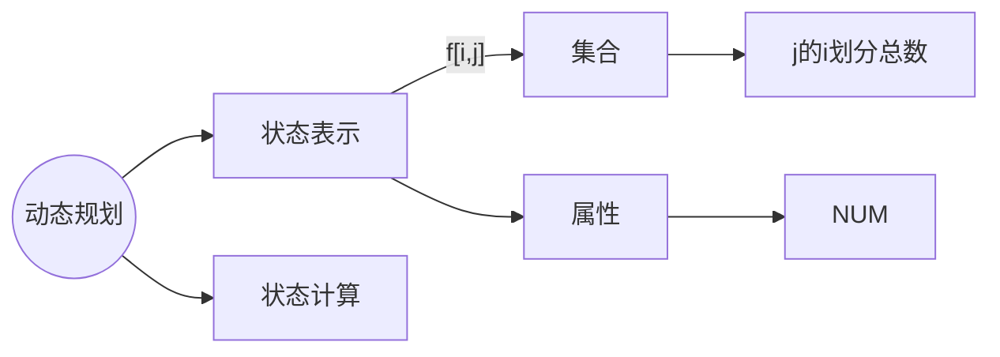
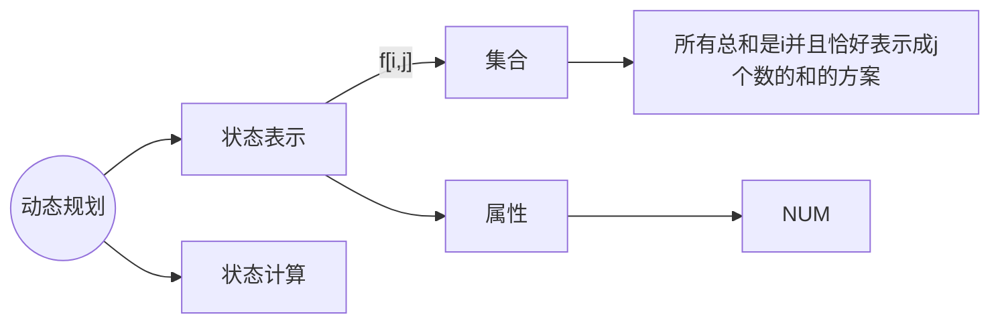

## 整数划分
可以看成是一个完全背包问题，容量为 n，物品的体积分别为 1, 2, ......, n，每种物品有无限个，求恰好装满背包的方案数
f[i, j] 表示所有从 1 ~ i 中选，体积恰好是 j 的选法方案数量


对于一个数 $n$,若可以将它划分成 $m$ 个数相加，则称这样的划分为 $n$ 的 $m$ 划分


对于 $\sum_{i=1}^{m} a_i = n$ 

1. 若 $∀a_i > 0$，则每个数减去 $1$，划分到 $i$ 组的总数就变成了 $j - i$
2. 若 $\exist a_i = 0$，则对应 $n$ 的 $m - 1$ 划分

### 递推方程
$f[i][j]=f[i-1][j]+f[i-1][j-i]+f[i-1][j-i*2]+...+f[i-1][j-i*s]$
$f[i][j-i]=~~~~~~~~~~~~~~~f[i-1][j-i]+f[i-1][j-i*2]+...+f[i-1][j-i*s]$

$f[i][j] = f[i][j-i] + f[i-1][j]$

```c++
void solve()
{
    cin >> n >> m >> M;
    //0 的 0 划分有 1 种方案
    f[0][0] = 1;
    for(int i = 1; i <= m; i ++)
    {
        for(int j = 0; j <= n; j ++)
        {
            if(j >= i)
                f[i][j] = (f[i][j - i] + f[i - 1][j]) % M;
            else
                f[i][j] = f[i - 1][j];
                //物品不够分，相当于有组别的物品数为 0
        }
    }

    cout << f[m][n] << endl;
}
```

一维
```cpp
#include<bits/stdc++.h>

using namespace std;

const int N = 1010, M = 1e9 + 7;

int n;
int f[N];

int main()
{
    cin >> n;

    f[0] = 1;
    for(int i = 1; i <= n; i ++)
    {
        for(int j = i; j <= n; j ++)
        {
            f[j] = (f[j] + f[j - i]) % M;
        }
    }
  
    cout << f[n] << endl;
    return 0;
}
```




最小值为 1，那么就可以表示成 f[i - 1, j - 1] 的方案
最小值大于 1，把每个数减去 1，每个数还是正整数，可以表示成 f[i - j, j] 的方案(和是 i - j,，数还是 j 个)

$f[i, j] = f[i - 1, j - 1] + f[i - j][j]$
$ans=f[n,1]+f[n,2]+f[n,3]+...+f[n][n]$

```cpp
#include<bits/stdc++.h>

using namespace std;

const int N = 1010, mod = 1e9 + 7;

int n;
int f[N][N];

int main()
{
    cin >> n;
    
    f[0][0] = 1;
    for(int i = 1; i <= n; i ++)
    {
        for(int j = 1; j <= i; j ++)
        {
            f[i][j] = (f[i - 1][j - 1] + f[i - j][j]) % mod;
        }
    }

    int res = 0;
    for(int i = 1; i <= n; i ++)
        res = (res + f[n][i]) % mod;

    cout << res << endl;

    return 0;
}
```