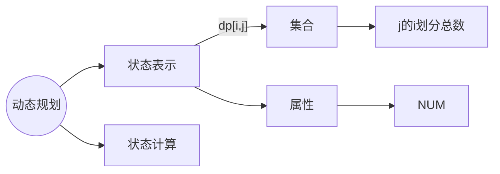

对于一个数 $n$,若可以将它划分成 $m$ 个数相加，则称这样的划分为 $n$ 的 $m$ 划分


对于 $\sum_{i=1}^{m} a_i = n$ 

1. 若 $∀a_i > 0$，则每个数减去 $1$，划分到 $i$ 组的总数就变成了 $j - i$
2. 若 $\exist a_i = 0$，则对应 $n$ 的 $m - 1$ 划分


### 递推方程

$dp[i][j] = dp[i][j-i] + dp[i-1][j]$


```c++
void solve()
{
    cin >> n >> m >> M;
    //0 的 0 划分有 1 种方案
    dp[0][0] = 1;
    for(int i = 1; i <= m; i ++)
    {
        for(int j = 0; j <= n; j ++)
        {
            if(j >= i)
                dp[i][j] = (dp[i][j - i] + dp[i - 1][j]) % M;
            else
                dp[i][j] = dp[i - 1][j];
                //物品不够分，相当于有组别的物品数为 0
        }
    }

    cout << dp[m][n] << endl;
}
```

