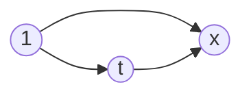

# $Dijkstra$

## 朴素版 $Dijkstra$

1. $dist[1]=0,~dist[i]=+∞$

2. $s:$ 当前已经确定最短距离的点

3. 
   for i : 0 ~ n:
   	t <- 不在 s 中的距离最近的点
   	s <- t
   	用 t 来更新其它所有点的距离


判断从 $1$ 到 $x$ 是否比从 $1$ 到 $t$ 再到 $x$ 大，如果大的话，就把到 $x$ 的距离更新

$dist[x] > dist[t] + w$

```cpp
#include<iostream>
#include<cstring>
#include<algorithm>

using namespace std;

const int N = 510;

int n, m;
int g[N][N];
int dist[N];
bool st[N];

int dijkstra()
{
    //初始化所有的距离为正无穷
    memset(dist, 0x3f, sizeof dist);
    dist[1] = 0; //把一号点的距离初始化为 0 

    //迭代 n 次
    for(int i = 0; i < n; i ++)
    {
        int t = -1;
        //找最小值，不在 st 中（没有确定最短路的点当中）的距离最小的值
        for(int j = 1; j <= n; j ++)
            //不在 st 中 
            if(!st[j] && (t == -1 || dist[t] > dist[j]))
                //当前这个点不是最短的
                t = j;
        
		if(t == n) break; //已经找到了最短距离
        
        //将 t 更新到数组里面
        st[t] = true;
	
        //用 1 到 t 的距离加上 t 到 j 的距离来更新 1 到 j 这条边的距离
        for(int j = 1; j <= n; j ++)
            dist[j] = min(dist[j], dist[t] + g[t][j]); 
    }
	
    //如果等于正无穷说明 1 和 n 不连通
    if(dist[n] == 0x3f3f3f3f)
        return -1;
    
    //否则返回最短距离
    return dist[n];
}

int main()
{
    scanf("%d%d", &n, &m);
    
    //初始化
    memset(g, 0x3f, sizeof g);

    while(m --)
    {
        int a, b, c;
        scanf("%d%d%d", &a, &b, &c);
        //重边中保留长度最短的一条边
        g[a][b] = min(g[a][b], c);
    }

    int t = dijkstra();

    printf("%d\n", t);

    return 0;    
}
```

## 堆优化版 $Dijkstra$


```cpp
#include<iostream>
#include<cstring>
#include<algorithm>
#include<queue>

using namespace std;

//用一个堆来维护结点的距离
typedef pair<int, int> PII;

const int N = 1e6 + 10;

int n, m;
int h[N], e[N], w[N], ne[N], idx; //w 代表权重
int dist[N];
bool st[N];

//邻接表的存储
void add(int a, int b, int c)
{
    e[idx] = b;
    w[idx] = c;
    ne[idx] = h[a];
    h[a] = idx ++;
}

int dijkstra()
{
    memset(dist, 0x3f, sizeof dist);  
    dist[1] = 0;
    
    //小根堆
    priority_queue<PII, vector<PII>, greater<PII>> heap;
    //将第一个点放进堆里面
    heap.push({0, 1});

    //堆里面不为空
    while(heap.size())
    {
        //每次找到当前距离最小的点，即小根堆的顶端
        auto t = heap.top();
        heap.pop();

        //ver 表示点的编号，distance 表示点的距离
        int ver = t.second, distance = t.first;
        if(st[ver])//如果这个点已经处理好了，说明他是一个冗余备份
            continue;

        st[ver] = true;
        
        for(int i = h[ver]; i != -1; i = ne[i])
        {
            int j = e[i];
            if(dist[j] > distance + w[i])
            {
                //更新距离
                dist[j] = distance + w[i];
                //将 j 更新到堆里面去
                heap.push({dist[j], j});
            }
        }
    }
    
    if(dist[n] == 0x3f3f3f3f) return -1;
    return dist[n];
}

int main()
{
    scanf("%d%d", &n, &m);

    memset(h, -1, sizeof h);

    while(m --)
    {
        int a, b, c;
        scanf("%d%d%d", &a, &b, &c);
        add(a, b, c);
    }

    printf("%d", dijkstra());

    return 0;
}
```

