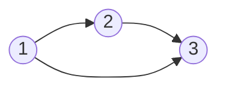

# 拓扑排序

拓扑序列一定是针对有向图来说的。无向图没有拓扑序列。

对于图：



它的拓扑序列为 $1~2~3$。

对于每条边来说，起点在终点的前面。

有向无环图一定存在拓扑序列，也成为拓扑图。

对于每个点，有 入度 和 出度。

入度就是有多少条边指向自己。

出度就是它有多少条边出去。

|      | 入度 | 出度 |
| :--: | :--: | :--: |
| $1$  | $0$  | $2$  |
| $2$  | $1$  | $1$  |
| $3$  | $2$  | $0$  |

入度为 $0$ 的点都可以排在最前面。

所以要先将所有入度为 $0$​ 的点放入队列，然后进行宽搜。

```cpp
queue <- 所有入度为 0 的点
while queue 不空
{
	t <- 队头
	枚举 t 的所有出边 t -> j
		删掉 t -> j, d[j] -- (也就是 j 的入度减 1)
		if(d[j] == 0) // 说明 j 前面的所有点都已经放好了。 j 就可以入队
		{
			queue <- j
		}
}
```
如果一个图上有环，那么这个环上的所有点的入度都不为 $0$，它们都不会入队。
而一个有向无环图，一定至少存在一个入度为 $0$ 的点。
### 有向图的拓扑排序


```cpp
#include<iostream>
#include<cstring>
#include<algorithm>

using namespace std;

const int N = 100010;

int n, m;
int h[N], e[N], ne[N], idx; //邻接表的存储
int q[N], d[N]; // q 是队列，d 存的是入度

void add(int a, int b)
{
    e[idx] = b;
    ne[idx] = h[a];
    h[a] = idx ++;
}

bool topsort()
{
    //定义队头队尾
    int hh = 0, tt = -1;    

    //把所有入度为 0 的点加到队列里面
    for(int i = 1; i <= n; i ++)
        if(!d[i])
            q[ ++ tt] = i; 

    while(hh <= tt)
    {
        int t = q[hh ++]; //取出队头元素

        //拓展队头元素
        for(int i = h[t]; i != -1; i = ne[i])
        {
            int j = e[i]; //找到出边
            d[j] --; //该点入度减 1
            
            //如果该点入度为 0，说明前面已经处理完了
            //可以把 j 加到队列里面去
            if(d[j] == 0)
                q[++ tt] = j;
        }
    }
    //判断所有点是否都入队
    return tt == n - 1;
}

int main()
{
    cin >> n >> m;
    
    memset(h, -1, sizeof h);

    for(int i = 0; i < m; i ++)
    {
        int a, b;
        cin >> a >> b;
        add(a, b);
        d[b] ++;
    }

    if(topsort())
    {
        for(int i = 0; i < n; i ++)
            printf("%d ", q[i]);
        puts("");
    }
    else
        puts("-1");
}
```

