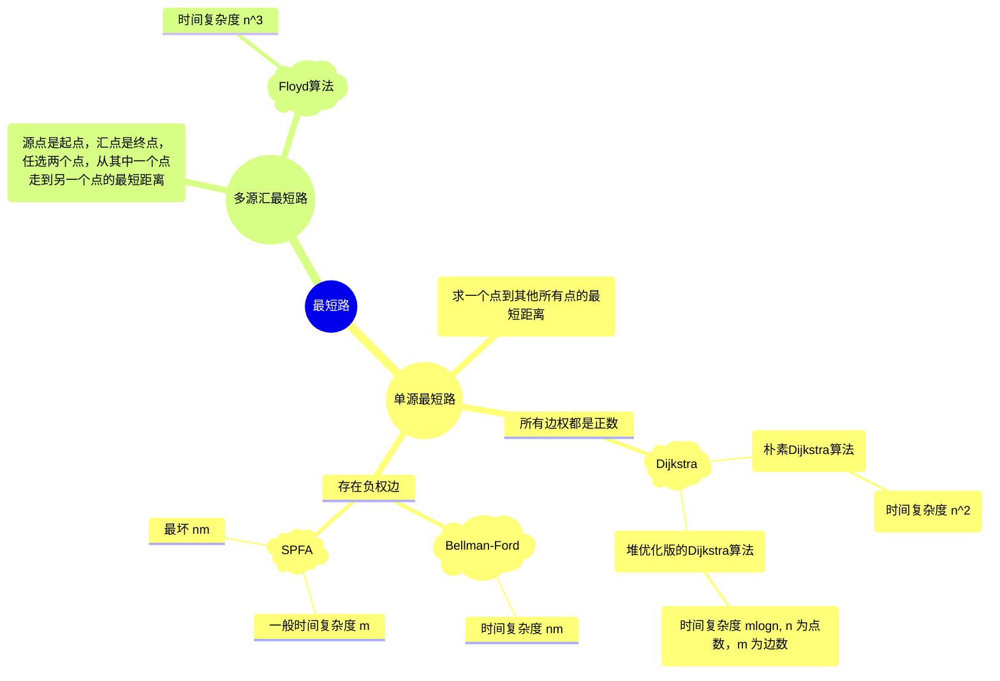
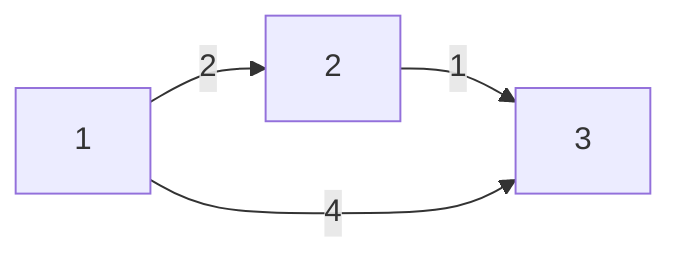
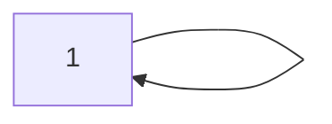
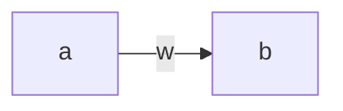
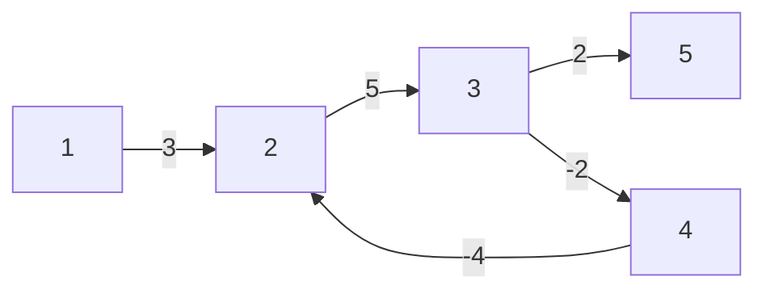

[TOC]

# **最短路**



# **单源最短路**

Dijkstra 算法要求**一定不能存在**负权边

## **朴素Dijkstra**

1. **初始化距离**

   dis[1] = 0 只有起点的距离是确定的

   dis[i] = +∞ 其他所有点的距离都不确定

2. **用一个 s 集合来表示当前已经确定了最短路径的点**

   for i in 0 ~ n:

   ​	t <- 不在 s 中的距离最近的点  $n^2$

   ​	s <- t  n次

   ​	用 t 来更新其他所有点的距离  m次

   ```mermaid
   graph LR;
   	1 --> x
   	1 --> t
   	t --> x
   ```

   ​	判断从 1 - x 的路径 dis[x] 和从 1 到 t 再到 x 的路径 dis[t] + w 大小，如果 dis[x] > dis[t] + w，则更新 dis[x]

例如



此时 dis[1] = 0, dis[2] = $\infty$, dis[3] = $\infty$

1 点的最短路径一定是 0

从 1 可以发出两条边，指向 2 的一条距离是 0 + 2 < $\infty$,所以更新 dis[2] = 2

指向 3 的一条距离是 0 + 4 = 4 < $\infty$,更新 dis[3] = 4

此时点 2 的最短路径已经确定了，所以用 2 更新一下到别的点的最短距离

从 2 到 3 号的距离是 dis[2] + 1 = 3 < dis[3] = 4,所以更新 dis[3] = 3

所以从 1 到 3 的最短距离是 3

### **Dijkstra求最短路**


根据数据的范围可知这是一个稠密图所以用邻接矩阵存储

#### 自环：



#### 重边：


对于重边，只用保留几条边中距离最短的一条边就可以了

```c++
#include<iostream>
#include<cstring>
#include<algorithm>

using namespace std;

const int N = 510;

int n, m;
int g[N][N];
int dist[N];
bool st[N];

int dijkstra()
{
    //初始化所有的距离为正无穷
    memset(dist, 0x3f, sizeof dist);
    dist[1] = 0; //把一号点的距离初始化为 0 

    //迭代 n 次
    for(int i = 0; i < n; i ++)
    {
        int t = -1;
        //找最小值，不在 st 中（没有确定最短路的点当中）的距离最小的值
        for(int j = 1; j <= n; j ++)
            //不在 st 中 
            if(!st[j] && (t == -1 || dist[t] > dist[j]))
                //当前这个点不是最短的
                t = j;
        
		if(t == n) break; //已经找到了最短距离
        
        //将 t 更新到数组里面
        st[t] = true;
	
        //用 1 到 t 的距离加上 t 到 j 的距离来更新 1 到 j 这条边的距离
        for(int j = 1; j <= n; j ++)
            dist[j] = min(dist[j], dist[t] + g[t][j]); 
    }
	
    //如果等于正无穷说明 1 和 n 不连通
    if(dist[n] == 0x3f3f3f3f)
        return -1;
    
    //否则返回最短距离
    return dist[n];
}

int main()
{
    scanf("%d%d", &n, &m);
    
    //初始化
    memset(g, 0x3f, sizeof g);

    while(m --)
    {
        int a, b, c;
        scanf("%d%d%d", &a, &b, &c);
        //重边中保留长度最短的一条边
        g[a][b] = min(g[a][b], c);
    }

    int t = dijkstra();

    printf("%d\n", t);

    return 0;    
}
```


## **堆优化版Dijkstra算法**

**稀疏图**，存储方式为 **邻接表**

1. 1 号点的距离初始化为 0，其他点初始化为无穷大

2. 将 1 号点放入堆中

3. 不断循环，直至堆为空。

   每一次循环操作弹出堆顶，并且标记该点的最短路径已经确定，用该点更新临界点的距离，更新成功后就加入到堆中

寻找路径最短的点：$O(n)$

加入集合: $O(n)$

更新距离: $O(mlogn)$

```c++
#include<iostream>
#include<cstring>
#include<algorithm>
#include<queue>

using namespace std;

//用一个堆来维护结点的距离
typedef pair<int, int> PII;

const int N = 1e6 + 10;

int n, m;
int h[N], e[N], w[M], ne[N], idx; //w 代表权重
int dist[N];
bool st[N];

//邻接表的存储
void add(int a, int b, int c)
{
    e[idx] = b;
    w[idx] = c;
    ne[idx] = h[a];
    h[a] = idx ++;
}

int dijkstra()
{
    memset(dist, 0x3f, sizeof dist);  
    dist[1] = 0;
    
    //定义小根堆
    //greater 将堆中元素按照降序排列，最小的元素具有最高的优先级
    priority_queue<PII, vector<PII>, greater<PII>> heap;
    //将第一个点放进堆里面
    //pair 排序的时候现根据 first 再根据 second进行排序
    //所以顺序不能改变
    heap.push({0, 1});

    //堆里面不为空
    while(heap.size())
    {
        //每次找到当前距离最小的点，即小根堆的顶端
        auto t = heap.top();
        heap.pop();

        //ver 表示点的编号，distance 表示点的距离
        int ver = t.second, distance = t.first;
        
        if(st[ver])//如果这个点已经处理好了，说明他是一个冗余备份
            continue;

        st[ver] = true;
        
        for(int i = h[ver]; i != -1; i = ne[i])
        {
            // i 是下标，e 中存的是 i 下标对应的点
            int j = e[i];
            if(dist[j] > dist[ver] + w[i])
            {
                //更新距离
                dist[j] = dist[ver] + w[i];
                //将 j 更新到堆里面去
                heap.push({dist[j], j});
            }
        }
    }
    
    if(dist[n] == 0x3f3f3f3f) return -1;
    return dist[n];
}

int main()
{
    scanf("%d%d", &n, &m);

    memset(h, -1, sizeof h);

    while(m --)
    {
        int a, b, c;
        scanf("%d%d%d", &a, &b, &c);
        add(a, b, c);
    }

    printf("%d", dijkstra());

    return 0;
}
```

## **Bellman-Ford算法**

处理有 **负权边** 的图

迭代 n 次，每次循环所有边



存储方式可以直接用结构体

更新方式
$$
dist[b] = min(dist[b], dist[a] + w)
$$
但是 **如果有负权回路*不一定*存在最短边**



如上图，如果从 1 到 2 到 3 再到 4 再到 2 无限循环之后长度是 $-\infty$，再从 5 出去，这样就不存在最短路

### **有边数限制的最短路径**


```c++
#include<iostream>
#include<cstdio>
#include<algorithm>
#include<cstring>

using namespace std;

const int N = 510, M = 10010;

int n, m, k;
int dist[N], backup[N];

struct Edge
{
    int a, b, w;
}edges[M];

void bellman_ford()
{
    memset(dist, 0x3f, sizeof dist);

    dist[1] = 0;
    for(int i = 0; i < k; i ++)
    {
        //backup 用来备份上一次迭代后的结果
        memcpy(backup, dist, sizeof dist);
        for(int j = 0; j < m; j ++)
        {
            int a = edges[j].a;
            int b = edges[j].b;
            int w = edges[j].w;
            dist[b] = min(dist[b], backup[a] + w);
        }
    }

    if(dist[n] > 0x3f3f3f3f / 2)
        printf("impossible");
    else printf("%d\n", dist[n]);
}

int main()
{
    scanf("%d%d%d", &n, &m, &k);

    for(int i = 0; i < m; i ++)
    {
        int a, b, w;
        scanf("%d%d%d", &a, &b, &w);
        edges[i] = {a, b, w};
    }

    bellman_ford();

    return 0;
}
```

## **SPFA算法**

只要 **没有负环** 就可以用

用宽搜的思想来进行优化。运用队列。如果一个点被更新过了，再拿他来更新别人。

queue <- 1

while queue 非空

1. t <- q.front()

   q.pop()

2. 更新 t 的所有出边	

   queue <- b (如果已经有了就不用重复加入了)


```c++
#include<iostream>
#include<cstring>
#include<algorithm>
#include<queue>

using namespace std;

//用一个堆来维护结点的距离
typedef pair<int, int> PII;

const int N = 1e6 + 10;

int n, m;
int h[N], e[N], w[N], ne[N], idx; //w 代表权重
int dist[N];
bool st[N];

//邻接表的存储
void add(int a, int b, int c)
{
    e[idx] = b;
    w[idx] = c;
    ne[idx] = h[a];
    h[a] = idx ++;
}

int spfa()
{
    memset(dist, 0x3f, sizeof dist);
    dist[1] = 0;

    queue<int> q;
    q.push(1);
    st[1] = true;

    while(q.size())
    {
        int t = q.front();
        q.pop();

        st[t] = false;

        for(int i = h[t]; i != -1; i = ne[i])
        {
            int j = e[i];
            if(dist[j] > dist[t] + w[i])
            {
                dist[j] = dist[t] + w[i];
                if(!st[j])
                {
                    q.push(j);
                    st[j] = true;
                }
            }
        }
    }
    
    return dist[n];
}

int main()
{
    scanf("%d%d", &n, &m);

    memset(h, -1, sizeof h);

    while(m --)
    {
        int a, b, c;
        scanf("%d%d%d", &a, &b, &c);
        add(a, b, c);
    }

    int t = spfa();

    if (t == 0x3f3f3f3f) 
        puts("impossible");
    else 
        printf("%d\n", t);

    return 0;
}
```

## **SPFA判断负环**

$dist[x]$ 表示当前从 $1$ 号点到 $x$ 点最短路径的长度

用 $cnt$ 统计当前每个点的最短路中所包含的边数，如果某点的最短路所包含的边数 $≥ n$​，则说明存在环

每次更新 $dist[x] = dist[t] + w[i];$

也要进行 $cnt[x]=cnt[t] + 1$​

从 $1$ 号点到 $t$ 再到 $x$ 的距离小于从 $1$ 到 $x$ 的距离

```c++
#include<iostream>
#include<cstring>
#include<cstdio>
#include<algorithm>
#include<queue>

using namespace std;

const int N = 2010, M = 10010;

int n, m;
int h[N], w[M], e[M], ne[M], idx;
int dist[N], cnt[N];
bool st[N];

void add(int a, int b, int c)
{
    e[idx] = b;
    w[idx] = c;
    ne[idx] = h[a];
    h[a] = idx ++;
}

bool spfa()
{
    queue<int> q;

    for(int i = 1; i <= n; i ++)
    {
        st[i] = true;
        q.push(i);
    }

    while(q.size())
    {
        int t = q.front();
        q.pop();

        st[t] = false;

        for(int i = h[t]; i != -1; i = ne[i])
        {
            int j = e[i];
            if(dist[j] > dist[t] + w[i])
            {
                dist[j] = dist[t] + w[i];
                cnt[j] = cnt[t] + 1;

                if(cnt[j] >= n)
                    return true;
                if(!st[j])
                {
                    q.push(j);
                    st[j] = true;
                }
            }
        }
    }

    return false;
}

int main()
{
    scanf("%d%d", &n, &m);

    memset(h, -1, sizeof h);

    while(m --)
    {
        int a, b, c;
        scanf("%d%d%d", &a, &b, &c);
        add(a, b, c);
    }

    if(spfa()) 
        puts("Yes");
    else
        puts("No");

    return 0;
}
```

# 【模板】负环

## 题目描述

给定一个 $n$ 个点的有向图，请求出图中是否存在**从顶点 $1$ 出发能到达**的负环。

负环的定义是：一条边权之和为负数的回路。

## 输入格式

**本题单测试点有多组测试数据**。

输入的第一行是一个整数 $T$，表示测试数据的组数。对于每组数据的格式如下：

第一行有两个整数，分别表示图的点数 $n$ 和接下来给出边信息的条数 $m$。

接下来 $m$ 行，每行三个整数 $u, v, w$。

- 若 $w \geq 0$，则表示存在一条从 $u$ 至 $v$ 边权为 $w$ 的边，还存在一条从 $v$ 至 $u$ 边权为 $w$ 的边。
- 若 $w < 0$，则只表示存在一条从 $u$ 至 $v$ 边权为 $w$ 的边。

## 输出格式

对于每组数据，输出一行一个字符串，若所求负环存在，则输出 `YES`，否则输出 `NO`。

## 样例 #1

### 样例输入 #1

```
2
3 4
1 2 2
1 3 4
2 3 1
3 1 -3
3 3
1 2 3
2 3 4
3 1 -8
```

### 样例输出 #1

```
NO
YES
```

## 提示

#### 数据规模与约定

对于全部的测试点，保证：

- $1 \leq n \leq 2 \times 10^3$，$1 \leq m \leq 3 \times 10^3$。
- $1 \leq u, v \leq n$，$-10^4 \leq w \leq 10^4$。
- $1 \leq T \leq 10$。

#### 提示

请注意，$m$ **不是** 图的边数。

```c++
#include<iostream>
#include<cstdio>
#include<cstring>
#include<algorithm>
#include<queue>

using namespace std;

// N 存储顶点的最大数量，M 存储边的最大数量
//因为可能存在双向的边，所以边的最大数量要开两倍
const int N = 2e3 + 10;
const int M = 6e3 + 10;

// h 为邻接表，用于存储每个顶点的边
// e 存储边的目标顶点
// w 为边的权重
// ne 为下一个相邻的边的索引
// idx 为边的索引
int h[N], e[M], w[M], ne[M], idx;
int t, n, m;
// dist 为顶点 1 到每个顶点的最短距离
// cnt 为顶点 1 到每个顶点的最短距离路径上的点的数量
int dist[N], cnt[N];
//st 为用于标记顶点是否在队列中的数组
bool st[N];

//将起始顶点 a，目标顶点 b，边的权重 c 加入到邻接表中
void add(int a, int b, int c)
{
    e[idx] = b;
    w[idx] = c;
    ne[idx] = h[a];
    h[a] = idx ++;
}

//用于检测是否存在从顶点 1 出发的负环
bool spfa()
{
    //初始化 dist 数组，表示初始时距离都为无穷大
    memset(dist, 0x3f, sizeof dist);
    //表示初始时路径上的点数都为 0 
    memset(cnt, 0, sizeof cnt);
    //表示初始时顶点都未加入队列
    memset(st, false, sizeof st);
    queue<int> q;
    
    //从顶点 1 出发的距离为 0 
    dist[1] = 0;
    st[1] = true;
    q.push(1);

    //在循环中，从队列中取出一个顶点，然后遍历它的所有邻接边
    while(q.size())
    {
        int t = q.front();
        q.pop();

        st[t] = false;

        for(int i = h[t]; i != -1; i = ne[i])
        {
            int j = e[i];
            //如果找到一条边能够松弛到达另一个顶点的距离，就更新距离和路径上的点数
            if(dist[j] > dist[t] + w[i])
            {
                dist[j] = dist[t] +w[i];
                cnt[j] = cnt[t] + 1;

                if(cnt[j] >= n)
                    return true;
                //如果某个顶点的距离被更新，并且它不在队列中，就将它加入队列。
                if(!st[j])
                {
                    q.push(j);
                    st[j] = true;
                }
            }
        }
    }
    return false;
}

int main()
{
    scanf("%d", &t);

    while(t --)
    {
        scanf("%d%d", &n, &m);
        memset(h, -1, sizeof h);
        idx = 0;
        for(int i = 1; i <= m; i ++)
        {
            int u, v, w;
            scanf("%d%d%d", &u, &v, &w);
            add(u, v, w);
            if(w >= 0)
                add(v, u, w);
        }

        if(spfa())
            puts("YES");
        else
            puts("NO");
    }
    
    return 0;
}
```


# **多源汇最短路**

## **Floyd算法**

初始 $d(i, j)$ 存储邻接矩阵存储所有的边

$for(k = 1; k <= n; k ++)$

​	$for(i = 1; i <= n; i ++)$

​		$for(j = 1; j <= n; j ++)$

​			$d(i,j) =min(d(i, j ), d(i, k) + d(k, j))$

循环遍历之后 $d(i, j)$ 存储的是从 $i$ 到 $j$ 一个最短路的长度

```c++
#include<iostream>
#include<cstring>
#include<algorithm>
#include<cstdio>

using namespace std;

const int N = 210, INF = 1e9;

int n, m, Q;
int d[N][N];

void floyd()
{
    for(int k = 1; k <= n; k ++)
        for(int i = 1; i <= n; i ++)
            for(int j = 1; j <= n; j ++)
                d[i][j] = min(d[i][j], d[i][k] + d[k][j]);
}

int main()
{
    scanf("%d%d%d", &n, &m, &Q);

    for(int i = 1; i <= n; i ++)
        for(int j = 1; j <= n; j ++)
        {
            //对角线上的元素设置为 0，因为每个点到自身的距离为 0 
            if(i == j)
                d[i][j] = 0;
            else
             	//初始化为无穷大，表示不可达
                d[i][j] = INF;
        }
    
    while(m --)
    {
        int a, b, w;
        scanf("%d%d%d", &a, &b, &w);
		
        //更新 a 到 b 的边的权值
        d[a][b] = min(d[a][b], w);
    }

    floyd();

    while(Q --)
    {
        int a, b;
        scanf("%d%d", &a, &b);

        if(d[a][b] > INF / 2)
            puts("impossible");
        else printf("%d\n", d[a][b]);
    }

    return 0;
}
```
如果是无向图中的最短路径
```c++
for(int i = 1; i <= m; i ++)
{
    int u, v, w;
    scanf("%d%d%d", &u, &v, &w);
    
    //无向图，应该同时考虑两个方位
    d[u][v] = min(d[u][v], w);
    d[v][u] = min(d[v][u], w);
}
```

### **[模板]传递闭包**


```c++
#include<iostream>
#include<cstring>
#include<cstdio>
#include<algorithm>

using namespace std;

const int N = 150;

int b[N][N];
int d[N][N];
int n;

void floyd()
{
    for(int k = 1; k <= n; k ++)
        for(int i = 1; i <= n; i ++)
            for(int j = 1; j <= n; j ++)
                d[i][j] |= (d[i][k] & d[k][j]);
}

int main()
{
    scanf("%d", &n);

    memset(d, 0, sizeof d);

    for(int i = 1; i <= n; i ++)
    {
        for(int j = 1; j <= n; j ++)
        {
            int w;
            scanf("%d", &w);
            
            if(w == 1)
                d[i][j] = 1;
        }
    }
    
    floyd();

    for(int i = 1; i <= n; i ++)
    {
        for(int j = 1; j <= n; j ++)
        {
            printf("%d ", d[i][j]);
        }
        printf("\n");
    }

    return 0;
}
```
$d[i][j] |= (d[i][k] \& d[k][j]);$ 是一种位运算

其中 $(d[i][k] \& d[k][j])$ 是进行与运算，两者都为 1 结果才会为 1

表示从顶点 `i` 可以直接或间接到达顶点 `k`，并且从顶点 `k` 可以直接或间接到达顶点 `j`

用 $d[i][j]$ 与这个结果进行或运算 即两者之中有其中一者为 1 结果就为 1

$d[i][j] = 1$ 表示从顶点 `i` 可以直接或间接到达顶点 `j`
