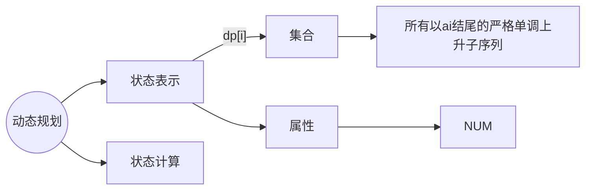

# LIS

# **最长上升子序列**



**划分依据："最后一个不同的点"**


当倒数第二位为空，则长度为 $1$

如果倒数第二位为 $a[k]$，

​	讨论第 $k$ 类中的上升子序列:

​	就是以 $a[k]$ 为结尾的上升子序列长度最大值再加 $1$

​	也就是 $f[k] + 1$

所以最终 $f[i] = MAX(f[1] + 1, f[2] + 1, ...,f[k] +1, 1)$

但是这些类只有在 $a[k] < a[i]$ 时存在

## **暴力做法 $O(n ^ 2)$**

$dp[i]$ 是以 $a_i$ 为末尾的最长上升子序列的长度

以 $a_i$ 结尾的上升子序列

1. 只包含 $a_i$ 的子序列
2. 在满足 $j < i$ 并且 $a_j < a_i$ 的以 $a_j$ 为结尾的上升子序列末尾，追加上 $a_i$ 后得到的子序列

```c++
void solve()
{
    cin >> n;
    for(int i = 0; i < n; i ++)
        cin >> a[i];
    
    int ans = 0;
    fill(dp, dp + n, 1);
    for(int i = 0; i < n; i ++)
    {
        for(int j = 0; j < i; j ++)
        {
            if(a[j] < a[i])
                dp[i] = max(dp[i], dp[j] + 1);
        }
        
        ans = max(ans, dp[i]);
    }
        
    cout << ans << endl;
}
```


## 优化 $O(logn)$

$L[n]$ 表示长度为 $i + 1$ 的递增子序列的末尾元素的最小值

$len_i$ 表示前 $i$ 个元素构成的最长递增子序列的长度


由于 $len_i$ 是按照升序记录的，所以可以用二分搜索来求 $L[j]~(j = 0 \sim len - 1)$ 中第一个大于等于 $A[i]$ 的元素的下标 $j$

```c++
void solve()
{
    int len = 1;

    cin >> n;
    for(int i = 0; i < n; i ++)
        cin >> a[i];

    L[0] = a[0];

    for(int i = 1; i < n; i ++)
    {
        //如果末尾元素比当前的元素小则序列加长
        if(L[len - 1] < a[i])
        {
            L[len ++] = a[i];
        }
        //更新 L[] 中所表示的递增子序列中的末尾元素的最小值
        else
            *lower_bound(L, L + len, a[i]) = a[i];
        //如果末尾元素大，则序列中按大小插入替换当前元素，序列长度不变
        //找到 L[j] 中第一个大于等于 a[i] 的元素的下标 j 
    }

    cout << len << endl;
}
```

