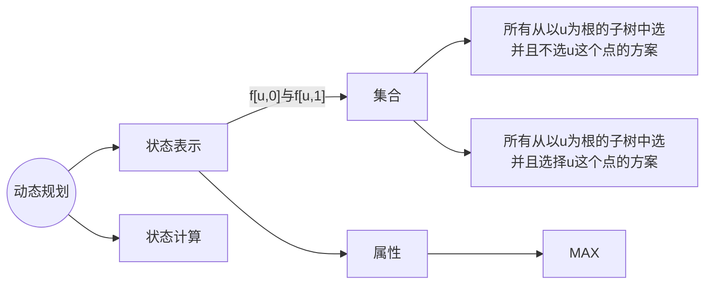

# **树形DP**

## **没有上司的舞会**

```mermaid
 graph LR;
 	id1((动态规划)) --> 状态表示 --f[u,0]与f[u,1] --> 集合 --> 所有从以u为根的子树中选并且不选u这个点的方案
 	集合 --> 所有从以u为根的子树中选并且选择u这个点的方案
    状态表示 --> 属性 --> MAX
    id1((动态规划)) --> 状态计算
```

