[TOC]


# **树**

树是一种特殊的图(无环且连通)

图分为 **有向图** 和 **无向图**

有向图 a ---> b

无向图 a ---> b  b ---> a

所以无向图其实也是有向图

有向图的存储

稠密图用邻接矩阵 稀疏图用邻接表

### 	**邻接矩阵**  

​		**g[a, b] 存储 a ---> b 这条边的信息**

​		不能存储重边

​		用的不多，时间复杂度 O( n² )

### 	**邻接表**

​	对于稀疏图十分有效，可以节省内存空间

通过链表的方式存储图的顶点和边的信息。通过数组 h e w ne 来表示

h 数组（头节点数组）：

​	大小通常为顶点的最大数量

​	每个元素 h[i] 存储了顶点 i 对应的链表的头指针。这个链表包含了从顶点 i 出发的所有边的信息

e 数组（边的目标顶点数组）：

​	对于每条边 e[idx] 存储了这条边连接到的目标顶点的编号

w 数组（边的权重数组）：

​	存储边的权重信息

​	对于每条边 w[idx] 存储了这条边的权重值

ne 数组（下一个相邻边的索引数组）

​	存储下一个相邻边的索引信息

​	对于每条边 ne[idx] 它存储了连接到同一个顶点的下一条边的索引

所以，对于每个顶点 i，可以通过访问 h[i] 来获取从该顶点出发的边的链表，然后遍历链表中的元素

#### 代码实现

```c++
void add(int a, int b, int c)
{
	e[idx] = b;
    w[idx] = c;
    ne[idx] = h[a];
    h[a] = idx ++;
}
```

对于图：	

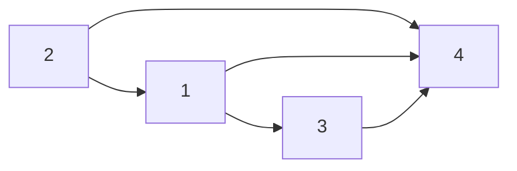

$$
\begin{flalign}
&h[1] -> 3 -> 4 -> \phi &\\
&h[2] -> 1 -> 4 -> \phi &\\
&h[3] -> 4 -> \phi &\\
&h[4] -> \phi &
\end{flalign}
$$

当加入一条边

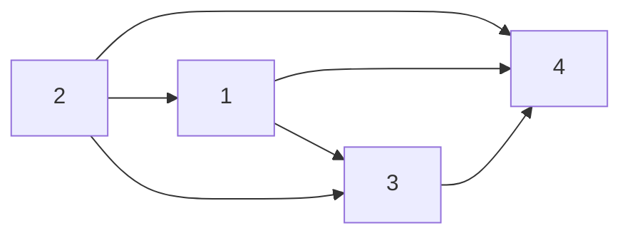

就变成了(一般是在头的位置插)
$$
\begin{flalign}
&h[1] -> 3 -> 4 -> \phi &\\
&h[2] -> 3 -> 1 -> 4 -> \phi &\\
&h[3] -> 4 -> \phi &\\
&h[4] -> \phi &
\end{flalign}
$$
每个点上都有一个单链表,存的是这个点可以走到哪个点

单链表内部点的次序是无关紧要的

### **树的存储**

```c++
const int N = 100010, M = N * 2;

int n, m;
//h 存的是链表头，e 存的是节点的值，ne 存的是 next 
int h[N], e[M], ne[M], idx;
bool st[N];

void add(int a, int b)
//插入一条 a 指向 b 的边
{
    /*  h[2] -> 1 
        h[a] 为 1
        要变成h[2] -> 3 -> 1
        ne[idx] = h[a] 就是让 3 指向 1
        再让 h[a] 变成 3(此时的 idx)
        idx 再加 1
    */
    e[idx] = b;
    //赋上 b 的值
    ne[idx] = h[a];
    h[a] = idx ++;
}
```

## **树的遍历**(图的遍历)

```c++
void dfs(int u)
{
    st[u] = true; //标记一下已经被搜过了
    
    for(int i = h[u]; i != -1; i = ne[i])
    {
        int j = e[i]; //存储当前节点在图里面对应的点的编号是多少
        if(!st[j])
            dfs(j);
        //如果 j 没有被搜过，就继续往下搜，一条路走到黑
    }
}
```


## **DFS**

**$O（n + m)$** 与点数和边数成线性关系

### **树的重心**


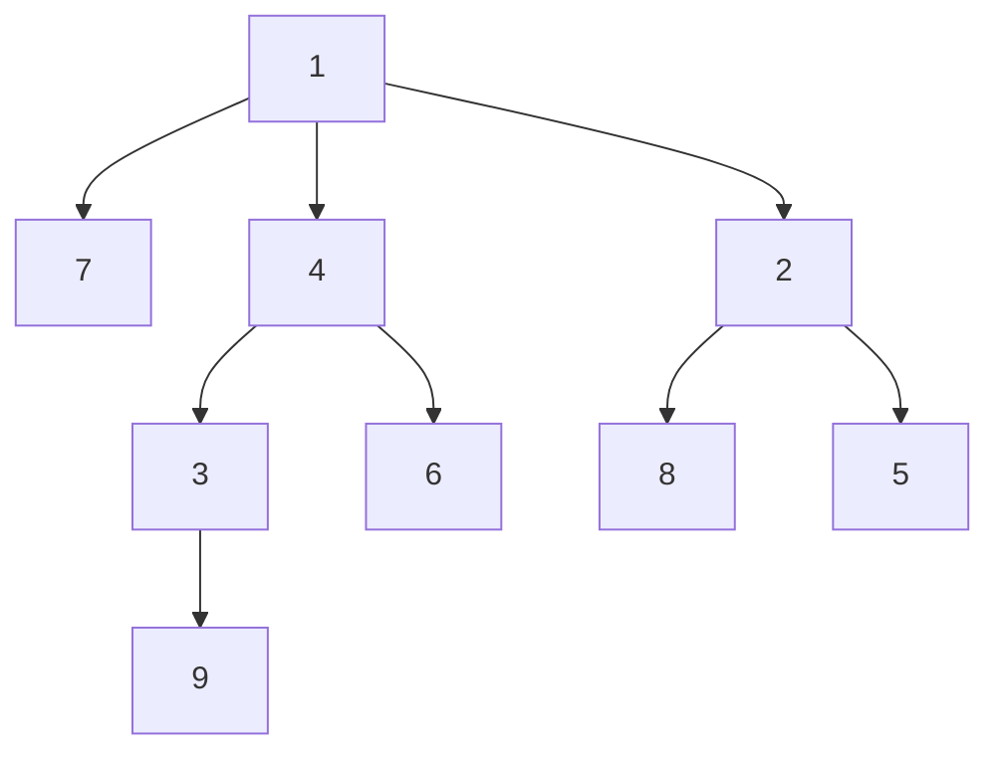

如果删掉根节点 1，那么还剩下 3 个连通块 7、 4 3 9 6 、2 8 5

​	其中，连通块里面点数最多的是 4 3 9 6 为 4

如果删掉节点 2，连通块就是 8、 5、以及左侧这一整个

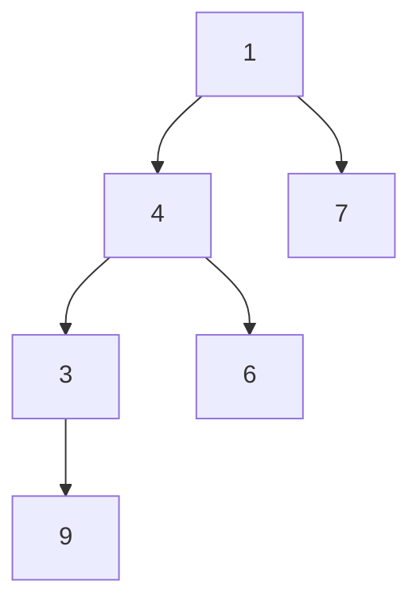

​	其中，连通块里面最多的点数就是 6

如果删掉节点 4，连通块就是 3 9、 6、以及

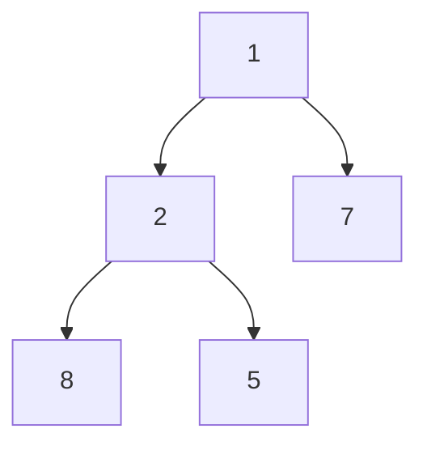

​	其中，连通块里面点数最多的是 5

......

依次类推

采用深度优先遍历的方法，可以在遍历的过程中找出子树的点数，例如在下图中，要求 4 的点数，即 3 的点数 + 6 的点数 加上 4 这一个点，就是 4 这个子树的点数

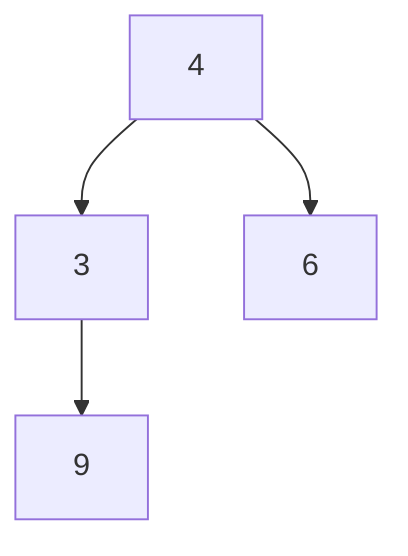

实际上，当删掉一个节点，例如删掉节点 4 的时候，下面这些的点数就等于总的点数 - 4 子树的点数


```c++
#include<iostream>
#include<cstring>
#include<algorithm>

using namespace std;

const int N = 100010, M = N * 2;

int ans = N;

int n, m;
//h 存的是链表头，e 存的是节点的值，ne 存的是 next 
int h[N], e[M], ne[M], idx;
bool st[N]; //一般的题目都是每个点只会遍历一次

void add(int a, int b)
{
    e[idx] = b;
    //赋上 b 的值
    ne[idx] = h[a];
    h[a] = idx ++;
}

//以 u 为根的子树中点的数量
int dfs(int u)
{
    st[u] = true; //标记一下已经被搜过了
    
    int sum = 1; //当前这个点算一个点
    int res = 0; //存储把节点删掉后每一个连通块点数的最大值
    for(int i = h[u]; i != -1; i = ne[i])
    {
        int j = e[i]; //存储当前节点在图里面对应的点的编号是多少
        if(!st[j])
        {
            int s = dfs(j); //表示当前子树的大小
            res = max(res, s); //当前的子树也算一个连通块
            sum += s; //以儿子为根节点的子树是以u为根节点的子树的一部分
        }
        
    }
    
    res = max(res, n - sum);

    ans = min(ans, res);
    
    return sum;
}

int main()
{
    cin >> n;

    memset(h, -1, sizeof(h));

    for(int i = 0; i < n - 1; i ++)
    {
        int a, b;
        cin >> a >> b;
        add(a, b);
        add(b, a);
        //因为是无向边
    }

    dfs(1); //节点编号从 1 开始
    
    cout << ans << endl;

    return 0;
}
```


## **BFS**

### **图中点的层次**


因为这道题中所有边的长度都是 1，所以可以用宽度优先搜索

从起点开始，每一次遍历一层节点。

当我们第一次发现一个点的路径，就相当于找到了到这个点的最短距离

```c++
#include<iostream>
#include<cstdio>
#include<algorithm>
#include<cstring>

using namespace std;

const int N = 100010;

int n, m;
int h[N], e[N], ne[N], idx;
int d[N], q[N]; // d 是距离，q 是队列

void add(int a, int b)
{
    e[idx] = b;
    ne[idx] = h[a];
    h[a] = idx ++;
}

int bfs()
{
    int hh = 0, tt = 0; //队头队尾
    q[0] = 1;

    memset(d, -1, sizeof d);

    d[1] = 0;

    while(hh <= tt)
    {
        int t = q[hh ++]; //取出队头

        for(int i = h[t]; i != -1; i = ne[i])
        {
            int j = e[i];
            if(d[j] == -1) // j 这个点没有被遍历过
            {
                d[j] = d[t] + 1;
                q[ ++ tt] = j;
            }
        }
    }

    return d[n];
}

int main()
{
    cin >> n >> m;

    memset(h, -1, sizeof h);

    for(int i = 0; i < m; i ++)
    {
        int a, b;
        cin >> a >> b;
        add(a, b);
    }

    cout << bfs() << endl;
    
    return 0;
}
```

### **有向图的拓扑排序**


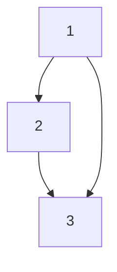

对于该图，1 指向 2，2 指向 3，1 指向 3

会发现构成 1 2 3 这样的一个序列 


一个有向无环图一定存在一个拓扑序列（所有的边都是从前指向后的）

入度：有多少条边指向自己

出度：有几条边出去

当前入度为 0 的点，都可以作为起点

1. 把所有入度为 0 的点入队
2. 当队列不空，取出队头 t，并且枚举 t 的所有出边 t -> j
3. 删掉 t -> j, 不过会导致 j 的入度 -1，所以应该 d[j] --;
4. 如果 d[j] == 0; 说明 j 前面的点都已经拍好了，就让 j 入队

一个有向无环图一定至少存在一个入度为 0 的点

```c++
#include<iostream>
#include<cstring>
#include<algorithm>

using namespace std;

const int N = 100010;

int n, m;
int h[N], e[N], ne[N], idx; //邻接表的存储
int q[N], d[N]; // q 是队列，d 存的是入度

void add(int a, int b)
{
    e[idx] = b;
    ne[idx] = h[a];
    h[a] = idx ++;
}

bool topsort()
{
    //定义队头队尾
    int hh = 0, tt = -1;    

    //把所有入度为 0 的点加到队列里面
    for(int i = 1; i <= n; i ++)
        if(!d[i])
            q[ ++ tt] = i; 

    while(hh <= tt)
    {
        int t = q[hh ++]; //取出队头元素

        //拓展队头元素
        for(int i = h[t]; i != -1; i = ne[i])
        {
            int j = e[i]; //找到出边
            d[j] --; //该点入度减 1
            
            //如果该点入度为 0，说明前面已经处理完了
            //可以把 j 加到队列里面去
            if(d[j] == 0)
                q[++ tt] = j;
        }
    }
    //判断所有点是否都入队
    return tt == n - 1;
}

int main()
{
    cin >> n >> m;
    
    memset(h, -1, sizeof h);

    for(int i = 0; i < m; i ++)
    {
        int a, b;
        cin >> a >> b;
        add(a, b);
        d[b] ++;
    }

    if(topsort())
    {
        for(int i = 0; i < n; i ++)
            printf("%d ", q[i]);
        puts("");
    }
    else
        puts("-1");
}
```


# **最小生成树**

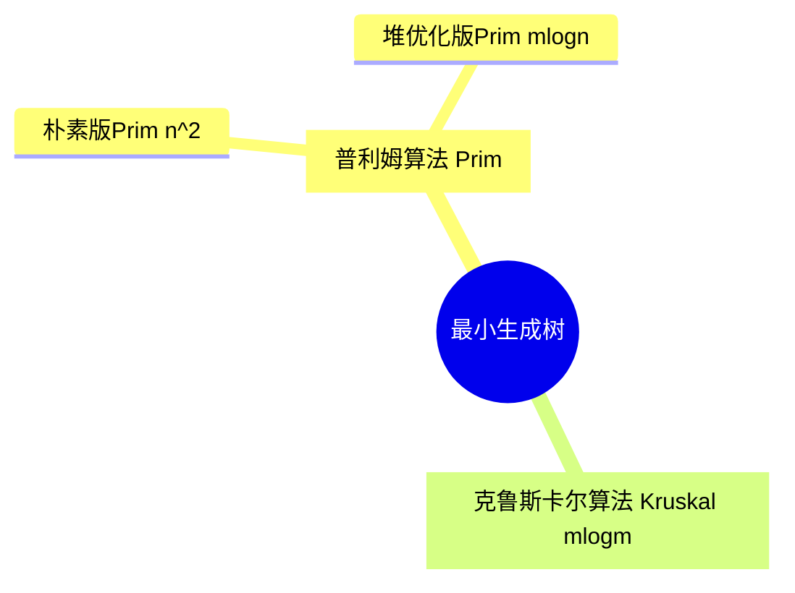

稠密图一般用朴素版的 **Prim** 算法

稀疏图一般用 **Kruskal** 算法

## **朴素版Prim算法**

集合 s 表示当前已经在连通块中的所有点

1. 处理所有距离为 $+\infty$
2. for(int i = 0; i < n; i ++)
   1. t <- 找到集合外距离最近的点
   2. 用 t 更新其他点到 **$\textcolor{red}{集合}$** 的距离
   3. st[t] = true 把 t 加到集合中去


```c++
#include<iostream>
#include<cstring>
#include<cstdio>
#include<algorithm>

using namespace std;

const int N = 510, INF = 0x3f3f3f3f;

int n, m;
int g[N][N];
int dist[N];
bool st[N];

int prim()
{
    memset(dist, 0x3f, sizeof dist);

    int res = 0;
    for(int i = 0; i < n; i ++)
    {
        int t = -1;
        for(int j = 1; j <= n; j ++)
        {
            if(!st[j] && (t == -1 || dist[t] > dist[j]))
                t = j;  
        }

        if(i && dist[t] == INF)
            return INF;
            
        if(i)
            res += dist[t];
        st[t] = true;

        for(int j = 1; j <= n; j ++)
            dist[j] = min(dist[j], g[t][j]);
    }
    return res;
}

int main()
{
    scanf("%d%d", &n, &m);
    
    memset(g, 0x3f, sizeof g);

    while(m --)
    {
        int a, b, c;
        scanf("%d%d%d", &a, &b, &c);
        g[a][b] = min(g[a][b], c);
        g[b][a] = min(g[b][a], c);
    }

    int  t = prim();

    if(t == INF)
        puts("impossible");
    else printf("%d\n", t);

    return 0;
}
```

## **Kruskal算法**

1. 将所有边按权重从小到大排序 $O(mlogm)$

2. 枚举每条边 $a$ $b$ 权重 $c$

   如果 $a$ $b$ $\textcolor{red}{不连通}$ ，将这条边加入到集合当中 $O(m)$

### **Kruskal求最小生成树**


```c++
#include<iostream>
#include<cstring>
#include<cstdio>
#include<algorithm>

using namespace std;

const int N = 100010, M = 200010, INF = 0x3f3f3f3f;

int n, m; // n 个点, m 条边
int p[N]; //并查集

struct Edge
{
    int a, b, w;
    //重载 < ，用于 sort 排序（默认是 < 排序）
    bool operator < (const Edge &W) const{
        return w < W.w;
    }
}edges[M]; //存储边的图

//并查集 找到 x 的祖宗节点
int find(int x)
{
    if(p[x] != x)
        p[x] = find(p[x]);
        //查找祖宗节点 + 路径压缩
    return p[x];
}

int kruskal()
{
    //将所有边按照权重大小升序排序
    sort(edges, edges + m);

    //初始化并查集
    for(int i = 1; i <= n; i ++)
        p[i] = i; //让每个点的祖宗都是自己
    
    //升序枚举每条边
    int res = 0, cnt = 0;
    for(int i = 0; i < m; i ++)
    {
        int a = edges[i].a, b = edges[i].b, w = edges[i].w;
        
        //判断 a, b 是否连通（即判断祖宗节点是否相同）
        a = find(a), b = find(b);
        if(a != b)
        {
            //如果不连通则让 a 的祖宗节点等于 b 的祖宗节点
            p[a] = b;
            res += w; // res 记录权重之和
            cnt ++; // cnt 记录最小生成树的边数
        }
    }

    if(cnt < n - 1) return INF; //不存在最小生成树
    return res;
}

int main()
{
    scanf("%d%d", &n, &m);
    for(int i = 0; i < m; i ++)
    {
        int a, b, w;
        scanf("%d%d%d", &a, &b, & w);
        edges[i] = {a, b, w};
    }

    int t = kruskal();

    if(t == INF)
        puts("impossible");
    else
        printf("%d\n", t);
    
    return 0;
}
```


# **二分图**

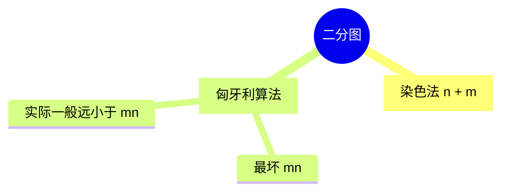

一个图是二分图，当且仅当图中不含奇数环（环当中的边数是奇数）

## **染色法**

可以用**深度优先遍历**

### **二分图**


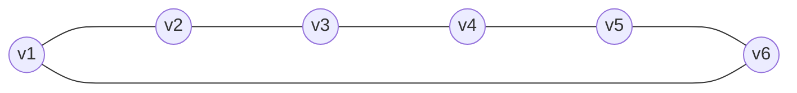

选择其中任意一个顶点，染成红色，再将该点的邻居染成蓝色，再从蓝色拓展出去，将蓝色的邻居染成红色，以此类推，如果在这个过程中，有个顶点和自己的邻居颜色一样，那么就说明不能构成二分图

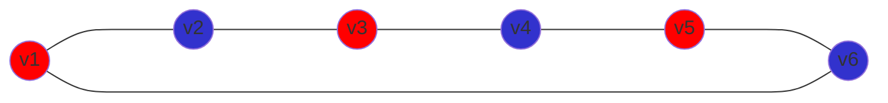

反例

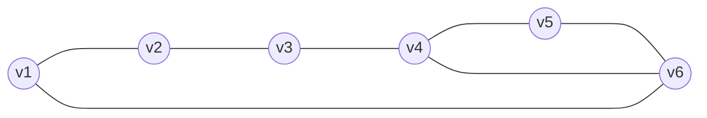

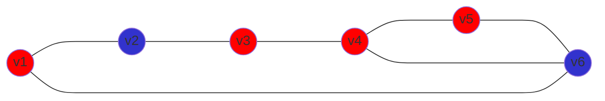

就会出现问题

### **染色法判定二分图**

		

```c++
#include<iostream>
#include<cstdio>
#include<cstring>
#include<algorithm>

using namespace std;

const int N = 100010, M = 200010; //无向图，所以边为点的两倍

int n, m;
int h[N], e[M], ne[M], idx;
int color[N];

//邻接矩阵存储图
void add(int a, int b)
{
    e[idx] = b, ne[idx] = h[a], h[a] = idx ++;
}

//深度优先遍历， c 记录染的颜色
bool dfs(int u, int c)
{
    color[u] = c;

    for(int i = h[u]; i != -1; i = ne[i])
    {
        int j = e[i];
        if(!color[j])
        {
            // 3 - c 是因为若颜色为 1 则染成 2，若颜色为 2 则染成 1
            if(!dfs(j, 3 - c))
                return false;
        }
        //如果颜色跟与它相连的颜色一样说明不成立
        else if(color[j] == c)
            return false;
    }
    return true;
}

int main()
{
    scanf("%d%d", &n, &m);
    
    memset(h, -1, sizeof h);

    while(m --)
    {
        int a, b;
        scanf("%d%d", &a, &b);
        add(a, b), add(b, a);
    }

    bool flag = true;
    for(int i = 1; i <= n; i ++)
    {
        if(!color[i])
        {
            if(!dfs(i, 1))
            {
                flag = false;
                break;
            }
        }
    }
    
    if(flag) puts("Yes");
    else puts("No");

    return 0;
}
```

## **匈牙利算法**

[匈牙利算法讲解链接](https://blog.csdn.net/WJPnb1/article/details/126332263)

### **二分图的最大匹配**


```c++
#include<iostream>
#include<algorithm>
#include<cstring>

using namespace std;

const int N = 510, M = 100010;

// n1 代表男生，n2 代表女生，从男生的角度出发进行匹配，将线段转换为从男生指向女生
int n1, n2, m;
int h[N], e[M], ne[M], idx;
int match[N]; //代表目前女生匹配的男朋友
bool st[N];

//邻接表存储图的信息
void add(int a, int b)
{
    e[idx] = b, ne[idx] = h[a], h[a] = idx ++;
}

//判断某男生是否能找到女朋友
bool find(int x)
{
    //相当于遍历 x 所有喜欢的女生
    for(int i = h[x]; i != -1; i = ne[i])
    {
        int j = e[i];
        //如果某个女生 j 没有被他预订过
        if(!st[j])
        {
            //标记这个女生 j 被他预订
            st[j] = true;
            //如果这时候女生没有被匹配过 那么预订就成功了
            //如果女生被男 k 在之前匹配过了，就 find(k) match[j] = k
            //在 find(match[j]) 过程中，因为 st[j] = true;
            //所以男 k 不能再选择女 j,因为女 j 已经被预订
            //他只能在自己喜欢的女生里面选择其他人来匹配
            //如果 find(match[j]) 返回 false 
            //即 if(match[j] == 0 || find(match[j])) 都不成立，男 x 就无法和女 j 配对
            if(match[j] == 0 || find(match[j]))
            {
                //将女生目前匹配的男朋友存为 x
                match[j] = x;
                return true;
            }
        }
    }

    return false;
}

int main()
{
    scanf("%d%d%d", &n1, &n2, &m);

    memset(h, -1, sizeof h);

    while(m --)
    {
        int a, b;
        scanf("%d%d", &a, &b);
        add(a, b);
    }

    int res = 0;
    for(int i = 1; i <= n1; i ++)
    {
        memset(st, false, sizeof st);
        if(find(i))
            res ++;
    }

    printf("%d\n", res);

    return 0;
}
```

